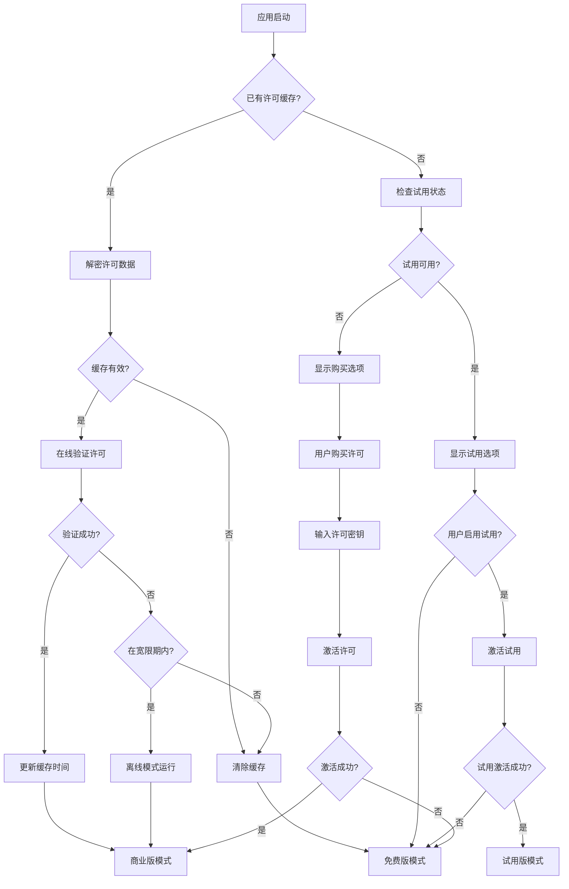

# Serial-Studio Licensing模块深度分析

## 概述

Licensing模块是Serial-Studio商业版许可证管理系统的核心组件，负责软件激活、许可验证、试用版管理和商业功能控制。该模块采用多层次安全架构，结合了硬件指纹绑定、加密存储、在线验证和离线容错机制，确保了许可证系统的安全性和可靠性。

### 模块架构设计

```
┌─────────────────────────────────────────────────────────────┐
│                    Licensing Module                         │
├─────────────────────────────────────────────────────────────┤
│  ┌─────────────────┐  ┌─────────────────┐  ┌──────────────┐ │
│  │  LemonSqueezy   │  │   MachineID     │  │  SimpleCrypt │ │
│  │  - API通讯      │  │  - 硬件指纹     │  │  - 数据加密  │ │
│  │  - 许可验证     │  │  - 设备绑定     │  │  - 密钥管理  │ │
│  │  - 状态管理     │  │  - 唯一标识     │  │  - 完整性    │ │
│  └─────────────────┘  └─────────────────┘  └──────────────┘ │
│  ┌─────────────────┐                                        │
│  │     Trial       │                                        │
│  │  - 试用激活     │                                        │
│  │  - 时间控制     │                                        │
│  │  - 功能限制     │                                        │
│  └─────────────────┘                                        │
└─────────────────────────────────────────────────────────────┘
```

## 1. LemonSqueezy类 - 商业许可管理核心

### 1.1 类结构与功能概述

LemonSqueezy类是商业许可证管理的核心组件，实现了完整的许可证生命周期管理：

```cpp
namespace Licensing
{
class LemonSqueezy : public QObject
{
  Q_OBJECT
  // 13个Q_PROPERTY属性，支持QML绑定和实时状态更新
  Q_PROPERTY(bool busy READ busy NOTIFY busyChanged)
  Q_PROPERTY(int seatLimit READ seatLimit NOTIFY licenseDataChanged)
  Q_PROPERTY(int seatUsage READ seatUsage NOTIFY licenseDataChanged)
  // ... 更多属性
};
}
```

**核心功能特性：**
- **单例模式**：确保全局唯一的许可证管理实例
- **异步API通讯**：使用QNetworkAccessManager与Lemon Squeezy API通讯
- **加密存储**：本地许可证数据使用SimpleCrypt加密存储
- **设备绑定**：基于MachineID实现设备级许可证绑定
- **离线容错**：支持30天离线使用的宽限期机制

### 1.2 许可证验证机制

#### 激活流程

```cpp
void LemonSqueezy::activate()
{
  // 1. 验证许可证密钥格式（36字符UUID）
  if (!canActivate()) return;
  
  // 2. 构建激活请求载荷
  QJsonObject payload;
  payload.insert("license_key", license());
  payload.insert("instance_name", MachineID::instance().machineId());
  
  // 3. 发送HTTPS请求到Lemon Squeezy API
  auto url = QUrl("https://api.lemonsqueezy.com/v1/licenses/activate");
  auto *reply = m_manager.post(request, payloadData);
  
  // 4. 异步处理响应
  connect(reply, &QNetworkReply::finished, 
          [this, reply]() { readActivationResponse(reply->readAll()); });
}
```

#### 验证流程

```cpp
void LemonSqueezy::validate()
{
  // 构建验证载荷
  QJsonObject payload;
  payload.insert("license_key", license());
  payload.insert("instance_id", instanceId());
  
  // 发送到验证端点
  auto url = QUrl("https://api.lemonsqueezy.com/v1/licenses/validate");
  // ... 异步处理
}
```

#### 多重安全验证

**服务器响应验证**：
```cpp
void LemonSqueezy::readValidationResponse(const QByteArray &data, bool cached)
{
  // 1. JSON解析验证
  auto doc = QJsonDocument::fromJson(data, &parseError);
  
  // 2. 商店ID和产品ID验证
  if (storeId != STORE_ID || productId != PRDCT_ID) {
    // 拒绝非官方许可证
    clearLicenseCache();
    return;
  }
  
  // 3. 设备绑定验证
  if (instanceName != MachineID::instance().machineId()) {
    // 检测跨设备使用
    clearLicenseCache(); 
    return;
  }
  
  // 4. 许可状态验证
  if (licenseStatus != "active") {
    // 处理过期或停用许可证
    clearLicenseCache();
    return;
  }
  
  // 5. 实例ID完整性验证
  if (instanceId.isEmpty()) {
    clearLicenseCache();
    return;
  }
}
```

### 1.3 许可证数据结构

**内部状态管理**：
```cpp
private:
  bool m_busy;                    // 操作忙状态
  int m_seatLimit;               // 授权设备数限制
  int m_seatUsage;               // 已使用设备数
  bool m_activated;              // 激活状态
  QString m_appName;             // 应用名称（根据许可等级）
  QString m_license;             // 许可证密钥
  QString m_instanceId;          // Lemon Squeezy分配的实例ID
  QString m_variantName;         // 许可变体名称
  QString m_instanceName;        // 设备实例名称
  QString m_customerName;        // 客户姓名
  QString m_customerEmail;       // 客户邮箱
  QDateTime m_activationDate;    // 激活日期
  
  int m_gracePeriod;             // 离线宽限期（天数）
  QJsonObject m_licensingData;   // 完整许可数据
  SimpleCrypt m_simpleCrypt;     // 加密工具
  QSettings m_settings;          // 持久化存储
```

### 1.4 离线容错机制

**宽限期管理**：
```cpp
void LemonSqueezy::readSettings()
{
  // 计算离线宽限期
  if (!dt.isEmpty()) {
    auto lastCheck = QDateTime::fromString(dateTime, Qt::RFC2822Date);
    if (lastCheck.isValid() && lastCheck < currentDt)
      m_gracePeriod = qMax(0, 30 - lastCheck.daysTo(currentDt));
  }
  
  // 验证缓存数据
  readValidationResponse(decryptedData, true);
}
```

**离线工作逻辑**：
- **在线验证**：每次启动时尝试连接服务器验证
- **缓存验证**：服务器不可达时使用本地缓存
- **宽限期**：提供30天离线使用期限
- **到期处理**：宽限期结束后清除许可证缓存

## 2. MachineID类 - 硬件指纹与设备绑定

### 2.1 设计原理

MachineID类实现跨平台的设备唯一标识生成，确保许可证与特定硬件绑定：

```cpp
namespace Licensing
{
class MachineID : public QObject
{
  Q_OBJECT
  Q_PROPERTY(QString machineId READ machineId CONSTANT)
  Q_PROPERTY(quint64 machineSpecificKey READ machineSpecificKey CONSTANT)
  
private:
  QString m_machineId;          // Base64编码的机器ID
  quint64 m_machineSpecificKey; // 机器特定加密密钥
};
}
```

### 2.2 跨平台硬件信息收集

**Linux系统**：
```cpp
#if defined(Q_OS_LINUX)
os = QStringLiteral("Linux");
// 优先读取 D-Bus 机器ID
process.start("cat", {"/var/lib/dbus/machine-id"});
process.waitForFinished();
id = process.readAllStandardOutput().trimmed();

// 备选方案：systemd机器ID
if (id.isEmpty()) {
  process.start("cat", {"/etc/machine-id"});
  process.waitForFinished();
  id = process.readAllStandardOutput().trimmed();
}
#endif
```

**macOS系统**：
```cpp
#if defined(Q_OS_MAC)
os = QStringLiteral("macOS");
// 使用IOKit获取平台UUID
process.start("ioreg", {"-rd1", "-c", "IOPlatformExpertDevice"});
process.waitForFinished();
QString output = process.readAllStandardOutput();

// 解析IOPlatformUUID
for (const QString &line : lines) {
  if (line.contains("IOPlatformUUID")) {
    id = line.split("=").last().trimmed().remove("\"");
    break;
  }
}
#endif
```

**Windows系统**：
```cpp
#if defined(Q_OS_WIN)
os = QStringLiteral("Windows");
QString machineGuid, uuid;

// 获取注册表MachineGuid
process.start("reg", {"query", 
  "HKEY_LOCAL_MACHINE\\SOFTWARE\\Microsoft\\Cryptography",
  "/v", "MachineGuid"});

// 获取WMI系统UUID
process.start("powershell", {"-ExecutionPolicy", "Bypass", 
  "-command", "(Get-CimInstance -Class Win32_ComputerSystemProduct).UUID"});

// 组合两个标识符
id = machineGuid + uuid;
#endif
```

**BSD系统**：
```cpp
#if defined(Q_OS_BSD)
os = QStringLiteral("BSD");
// 尝试读取hostid
process.start("cat", {"/etc/hostid"});

// 备选方案：SMBIOS UUID
if (id.isEmpty()) {
  process.start("kenv", {"-q", "smbios.system.uuid"});
}
#endif
```

### 2.3 加密哈希生成

**安全哈希算法**：
```cpp
void MachineID::readInformation()
{
  // 组合机器标识符、应用名称和操作系统
  auto data = QString("%1@%2:%3").arg(qApp->applicationName(), id, os);
  
  // 使用BLAKE2s-128进行哈希
  auto hash = QCryptographicHash::hash(data.toUtf8(),
                                      QCryptographicHash::Blake2s_128);
  
  // 生成Base64编码的机器ID
  m_machineId = QString::fromUtf8(hash.toBase64());
  
  // 提取64位加密密钥
  m_machineSpecificKey = qFromBigEndian<quint64>(hash.left(8));
}
```

**安全特性**：
- **单向哈希**：无法从机器ID逆向推导硬件信息
- **隐私保护**：不包含可识别的个人或硬件信息
- **一致性**：同一设备总是生成相同的ID
- **唯一性**：不同设备生成不同的ID
- **篡改检测**：硬件变更会导致ID变化

## 3. SimpleCrypt类 - 数据加密与完整性保护

### 3.1 加密算法设计

SimpleCrypt实现了轻量级但有效的对称加密方案：

```cpp
namespace Licensing
{
class SimpleCrypt
{
public:
  enum CompressionMode {
    CompressionAuto,    // 自动压缩
    CompressionAlways,  // 总是压缩  
    CompressionNever    // 从不压缩
  };
  
  enum IntegrityProtectionMode {
    ProtectionNone,     // 无保护
    ProtectionChecksum, // 校验和保护
    ProtectionHash      // 哈希保护
  };
  
  enum Error {
    ErrorNoError,
    ErrorNoKeySet,
    ErrorUnknownVersion,
    ErrorIntegrityFailed
  };
};
}
```

### 3.2 加密流程实现

**数据加密过程**：
```cpp
QByteArray SimpleCrypt::encryptToByteArray(const QByteArray &plaintext)
{
  QByteArray ba = plaintext;
  CryptoFlags flags = CryptoFlagNone;
  
  // 1. 可选数据压缩
  if (m_compressionMode == CompressionAlways) {
    ba = qCompress(ba, 9);
    flags |= CryptoFlagCompression;
  }
  
  // 2. 完整性保护
  QByteArray integrityProtection;
  if (m_protectionMode == ProtectionChecksum) {
    flags |= CryptoFlagChecksum;
    QDataStream s(&integrityProtection, QIODevice::WriteOnly);
    s << qChecksum(ba, Qt::ChecksumIso3309);
  }
  else if (m_protectionMode == ProtectionHash) {
    flags |= CryptoFlagHash;
    QCryptographicHash hash(QCryptographicHash::Sha1);
    hash.addData(ba);
    integrityProtection += hash.result();
  }
  
  // 3. 添加随机前缀
  char randomChar = char(QRandomGenerator::securelySeeded().generate() & 0xFF);
  ba = randomChar + integrityProtection + ba;
  
  // 4. XOR加密
  int pos(0);
  char lastChar(0);
  while (pos < ba.size()) {
    ba[pos] = ba.at(pos) ^ m_keyParts.at(pos % 8) ^ lastChar;
    lastChar = ba.at(pos);
    ++pos;
  }
  
  // 5. 添加版本和标志头
  QByteArray resultArray;
  resultArray.append(char(0x03));  // 版本号
  resultArray.append(char(flags)); // 加密标志
  resultArray.append(ba);
  
  return resultArray;
}
```

**数据解密过程**：
```cpp
QByteArray SimpleCrypt::decryptToByteArray(const QByteArray &cypher)
{
  // 1. 版本检查
  char version = ba.at(0);
  if (version != 3) {
    m_lastError = ErrorUnknownVersion;
    return QByteArray();
  }
  
  // 2. 标志解析
  CryptoFlags flags = CryptoFlags(ba.at(1));
  ba = ba.mid(2);
  
  // 3. XOR解密
  int pos(0);
  char lastChar = 0;
  while (pos < ba.size()) {
    char currentChar = ba[pos];
    ba[pos] = ba.at(pos) ^ lastChar ^ m_keyParts.at(pos % 8);
    lastChar = currentChar;
    ++pos;
  }
  
  // 4. 移除随机前缀
  ba = ba.mid(1);
  
  // 5. 完整性验证
  bool integrityOk(true);
  if (flags.testFlag(CryptoFlagChecksum)) {
    quint16 storedChecksum;
    QDataStream s(&ba, QIODevice::ReadOnly);
    s >> storedChecksum;
    ba = ba.mid(2);
    quint16 checksum = qChecksum(ba, Qt::ChecksumIso3309);
    integrityOk = (checksum == storedChecksum);
  }
  else if (flags.testFlag(CryptoFlagHash)) {
    QByteArray storedHash = ba.left(20);
    ba = ba.mid(20);
    QCryptographicHash hash(QCryptographicHash::Sha1);
    hash.addData(ba);
    integrityOk = (hash.result() == storedHash);
  }
  
  // 6. 完整性检查失败处理
  if (!integrityOk) {
    m_lastError = ErrorIntegrityFailed;
    return QByteArray();
  }
  
  // 7. 可选解压缩
  if (flags.testFlag(CryptoFlagCompression))
    ba = qUncompress(ba);
    
  return ba;
}
```

### 3.3 密钥分割算法

**64位密钥分割为8字节**：
```cpp
void SimpleCrypt::splitKey()
{
  m_keyParts.clear();
  m_keyParts.resize(8);
  
  for (int i = 0; i < 8; i++) {
    quint64 part = m_key;
    for (int j = i; j > 0; j--)
      part = part >> 8;    // 右移8位
    
    part = part & 0xff;    // 保留最低8位
    m_keyParts[i] = static_cast<char>(part);
  }
}
```

## 4. Trial类 - 试用版管理

### 4.1 试用版架构

Trial类管理时间限制的试用许可证：

```cpp
namespace Licensing
{
class Trial : public QObject
{
  Q_OBJECT
  Q_PROPERTY(bool busy READ busy NOTIFY busyChanged)
  Q_PROPERTY(bool firstRun READ firstRun NOTIFY enabledChanged)
  Q_PROPERTY(bool trialEnabled READ trialEnabled NOTIFY enabledChanged)
  Q_PROPERTY(bool trialExpired READ trialExpired NOTIFY enabledChanged)
  Q_PROPERTY(int daysRemaining READ daysRemaining NOTIFY enabledChanged)
  Q_PROPERTY(bool trialAvailable READ trialAvailable NOTIFY availableChanged)
  
private:
  bool m_busy;
  bool m_trialEnabled;      // 试用已启用
  bool m_deviceRegistered;  // 设备已注册
  SimpleCrypt m_crypt;      // 加密工具
  QSettings m_settings;     // 设置存储
  QDateTime m_trialExpiry;  // 试用到期时间
};
}
```

### 4.2 试用版状态管理

**状态判断逻辑**：
```cpp
// 首次运行检测
bool Trial::firstRun() const
{
  return !m_deviceRegistered && !m_trialEnabled && trialAvailable();
}

// 试用版启用检测
bool Trial::trialEnabled() const
{
  return m_deviceRegistered && m_trialEnabled && trialAvailable();
}

// 试用版过期检测
bool Trial::trialExpired() const
{
  return m_deviceRegistered && !m_trialEnabled && trialAvailable();
}

// 试用版可用性检测
bool Trial::trialAvailable() const
{
  const bool activated = LemonSqueezy::instance().isActivated();
  return !activated;  // 商业版激活时试用版不可用
}

// 剩余天数计算
int Trial::daysRemaining() const
{
  return QDateTime::currentDateTimeUtc().daysTo(m_trialExpiry);
}
```

### 4.3 试用版激活流程

**服务器通讯**：
```cpp
void Trial::fetchTrialState()
{
  // 1. 生成时间戳和随机数
  qint64 timestamp = QDateTime::currentSecsSinceEpoch();
  QString nonce = QUuid::createUuid().toString(QUuid::WithoutBraces);
  
  // 2. 构建JSON载荷
  QJsonObject payload;
  payload["machine_id"] = MachineID::instance().machineId();
  payload["timestamp"] = QString::number(timestamp);
  payload["nonce"] = nonce;
  
  // 3. 发送到试用激活服务器
  QUrl url("https://cloud.serial-studio.com/trial");
  QNetworkRequest request(url);
  request.setHeader(QNetworkRequest::ContentTypeHeader, "application/json");
  m_manager.post(request, payloadData);
}
```

**响应处理**：
```cpp
void Trial::onServerReply(QNetworkReply *reply)
{
  // 1. 网络错误检查
  if (reply->error() != QNetworkReply::NoError) {
    // 显示错误消息
    return;
  }
  
  // 2. JSON解析
  QJsonDocument document = QJsonDocument::fromJson(data, &parseError);
  if (parseError.error != QJsonParseError::NoError) {
    // 处理解析错误
    return;
  }
  
  // 3. 响应字段验证
  const auto object = document.object();
  const auto expiryVal = object.value("expireAt");
  const auto enabledVal = object.value("trialEnabled");
  const auto deviceRegistered = object.value("registered");
  
  if (expiryVal.isString() && enabledVal.isBool() && deviceRegistered.isBool()) {
    // 4. 设置试用状态
    QDateTime expiry = QDateTime::fromString(expiryStr, Qt::ISODate).toUTC();
    if (expiry.isValid()) {
      // 限制最长试用期为14天
      const QDateTime now = QDateTime::currentDateTimeUtc();
      if (expiry > now.addDays(14))
        expiry = now.addDays(14);
        
      m_trialExpiry = expiry;
      m_trialEnabled = enabledVal.toBool();
      m_deviceRegistered = deviceRegistered.toBool();
    }
  }
  
  // 5. 保存状态并发出信号
  writeSettings();
  Q_EMIT enabledChanged();
}
```

### 4.4 安全存储机制

**加密存储**：
```cpp
void Trial::writeSettings()
{
  QString enaStr = m_trialEnabled ? "true" : "false";
  QString regStr = m_deviceRegistered ? "true" : "false";
  QString expStr = m_trialExpiry.toString(Qt::ISODate);
  
  m_settings.beginGroup("trial");
  m_settings.setValue("expiry", m_crypt.encryptToString(expStr));
  m_settings.setValue("enabled", m_crypt.encryptToString(enaStr));
  m_settings.setValue("registd", m_crypt.encryptToString(regStr));
  m_settings.endGroup();
}

void Trial::readSettings()
{
  m_settings.beginGroup("trial");
  auto expStr = m_crypt.decryptToString(m_settings.value("expiry").toString());
  auto enaStr = m_crypt.decryptToString(m_settings.value("enabled").toString());
  auto regStr = m_crypt.decryptToString(m_settings.value("registd").toString());
  m_settings.endGroup();
  
  // 验证解密数据并设置状态
  // ...
}
```

## 5. 许可证系统集成与权限控制

### 5.1 模块间依赖关系

**依赖关系图**：
```
LemonSqueezy ←→ Trial       (互斥关系)
     ↓              ↓
 MachineID ←─── SimpleCrypt  (共享加密密钥)
     ↓              ↓
   QSettings ←─────┘         (持久化存储)
```

**初始化顺序**：
```cpp
// Trial构造函数中的依赖同步
Trial::Trial()
{
  // 1. 同步激活状态变化
  connect(this, &Licensing::Trial::enabledChanged,
          &Licensing::LemonSqueezy::instance(),
          &Licensing::LemonSqueezy::activatedChanged);
          
  // 2. 监听商业版激活状态
  connect(&Licensing::LemonSqueezy::instance(),
          &Licensing::LemonSqueezy::activatedChanged, this,
          &Licensing::Trial::availableChanged);
  
  // 3. 配置加密
  m_crypt.setKey(MachineID::instance().machineSpecificKey());
  m_crypt.setIntegrityProtectionMode(SimpleCrypt::ProtectionHash);
  
  // 4. 加载设置
  if (!LemonSqueezy::instance().isActivated())
    readSettings();
}
```

### 5.2 商业功能权限控制

**应用名称动态设置**：
```cpp
void LemonSqueezy::readValidationResponse(/*...*/)
{
  // 根据许可变体设置应用名称
  auto list = variantName.split("-");
  if (list.count() >= 1)
    m_appName = tr("%1 %2").arg(APP_NAME, list.first().simplified());
  else
    m_appName = tr("%1 Pro").arg(APP_NAME);
    
  // 更新Qt应用显示名称
  qApp->setApplicationDisplayName(appName());
}
```

**功能可用性检查**：
在Serial-Studio中，商业功能通过检查许可状态来控制：

```cpp
// 示例：检查是否可以使用高级功能
bool isProFeatureAvailable() 
{
  return LemonSqueezy::instance().isActivated() || 
         Trial::instance().trialEnabled();
}

// 示例：检查是否可以使用3D绘图功能
bool is3DPlotAvailable()
{
  const auto& variant = LemonSqueezy::instance().variantName();
  return variant.contains("Enterprise") || variant.contains("Elite");
}
```

## 6. 安全机制分析

### 6.1 多层安全防护

**1. 通讯安全**：
- 所有API通讯使用HTTPS加密
- 使用官方Lemon Squeezy API端点
- 验证SSL证书和域名

**2. 数据完整性**：
- 使用SHA-1哈希验证数据完整性
- 检测数据篡改和损坏
- 版本控制确保兼容性

**3. 设备绑定**：
- 基于硬件特征生成唯一机器ID
- 跨设备使用检测和阻止
- 机器ID变更时自动清除缓存

**4. 加密存储**：
- 本地数据使用机器特定密钥加密
- 无法在不同设备间复制许可证数据
- 随机化前缀防止模式分析

### 6.2 反篡改机制

**代码级保护**：
```cpp
// 硬编码的官方商店和产品ID
static constexpr quint64 STORE_ID = 170454;
static constexpr quint64 PRDCT_ID = 496241;

// 严格验证
if (storeId != STORE_ID || productId != PRDCT_ID) {
  qWarning() << "[LemonSqueezy] Store ID or Product ID mismatch";
  Misc::Utilities::showMessageBox(
    tr("The license key you provided does not belong to Serial Studio."),
    tr("Please double-check that you purchased your license from the "
       "official Serial Studio store."),
    QMessageBox::Critical);
  clearLicenseCache();
  return;
}
```

**运行时检查**：
```cpp
// 机器ID匹配验证
if (instanceName != MachineID::instance().machineId()) {
  qWarning() << "[LemonSqueezy] Machine ID mismatch";
  Misc::Utilities::showMessageBox(
    tr("This license key was activated on a different device."),
    tr("Please deactivate it there first or contact support for help."),
    QMessageBox::Critical);
  clearLicenseCache();
  return;
}
```

### 6.3 离线容错与防滥用

**宽限期机制**：
- 30天离线使用宽限期
- 基于最后验证时间计算
- 超期后自动清除许可证缓存

**防滥用措施**：
- 试用期最长14天限制
- 每台设备只能激活一次试用
- 试用与商业版互斥

## 7. 许可证验证流程图



## 8. 错误处理与用户体验

### 8.1 错误类型与处理

**网络错误处理**：
```cpp
if (reply->error() != QNetworkReply::NoError) {
  qWarning() << "Activation server unreachable. License validation failed.";
  
  if (m_gracePeriod <= 0) {
    qWarning() << "Grace period expired. Clearing cached license.";
    clearLicenseCache();
  } else {
    qWarning() << "You have" << m_gracePeriod 
               << "day(s) remaining in your grace period.";
  }
  return;
}
```

**数据完整性错误**：
```cpp
if (!integrityOk) {
  m_lastError = ErrorIntegrityFailed;
  return QByteArray();
}
```

**用户友好的错误消息**：
```cpp
Misc::Utilities::showMessageBox(
  tr("There was an issue validating your license."), 
  error.toString(),
  QMessageBox::Critical);
```

### 8.2 状态反馈机制

**实时状态更新**：
- 使用Qt信号/槽机制
- 支持QML属性绑定
- 异步操作状态反馈

**UI状态同步**：
```cpp
// 状态变更时发出信号
Q_EMIT busyChanged();
Q_EMIT licenseDataChanged();
Q_EMIT activatedChanged();
```

## 9. VSCode插件许可证系统设计建议

### 9.1 核心架构适配

基于Serial-Studio的Licensing模块，为VSCode插件设计许可证系统：

```typescript
// 许可证管理器接口
interface LicenseManager {
  // 状态管理
  isActivated(): boolean;
  isTrialActive(): boolean;
  getTrialDaysRemaining(): number;
  
  // 操作接口
  activateLicense(key: string): Promise<ActivationResult>;
  validateLicense(): Promise<ValidationResult>;
  deactivateLicense(): Promise<void>;
  
  // 试用管理
  startTrial(): Promise<TrialResult>;
  checkTrialEligibility(): boolean;
  
  // 事件监听
  onLicenseStateChanged(callback: (state: LicenseState) => void): void;
}
```

### 9.2 安全存储实现

```typescript
// VSCode环境下的安全存储
class SecureLicenseStorage {
  private context: vscode.ExtensionContext;
  private crypto: NodeCrypto;
  
  constructor(context: vscode.ExtensionContext) {
    this.context = context;
    this.crypto = new NodeCrypto(this.getMachineKey());
  }
  
  // 获取机器特定密钥
  private getMachineKey(): string {
    const machineId = this.generateMachineId();
    return crypto.createHash('sha256').update(machineId).digest('hex');
  }
  
  // 加密存储许可证数据
  async storeLicenseData(data: LicenseData): Promise<void> {
    const encrypted = this.crypto.encrypt(JSON.stringify(data));
    await this.context.globalState.update('license_data', encrypted);
  }
  
  // 解密读取许可证数据
  async readLicenseData(): Promise<LicenseData | null> {
    const encrypted = this.context.globalState.get<string>('license_data');
    if (!encrypted) return null;
    
    try {
      const decrypted = this.crypto.decrypt(encrypted);
      return JSON.parse(decrypted);
    } catch (error) {
      // 解密失败，清除缓存
      await this.clearLicenseData();
      return null;
    }
  }
}
```

### 9.3 功能控制机制

```typescript
// 功能权限控制
class FeatureGate {
  private licenseManager: LicenseManager;
  
  constructor(licenseManager: LicenseManager) {
    this.licenseManager = licenseManager;
  }
  
  // 检查基础商业功能
  canUseProFeatures(): boolean {
    return this.licenseManager.isActivated() || 
           this.licenseManager.isTrialActive();
  }
  
  // 检查高级功能
  canUseAdvancedVisualization(): boolean {
    if (!this.canUseProFeatures()) return false;
    
    const licenseType = this.licenseManager.getLicenseType();
    return licenseType === 'enterprise' || licenseType === 'elite';
  }
  
  // 检查数据导出功能
  canExportData(): boolean {
    return this.canUseProFeatures();
  }
  
  // 检查插件扩展功能
  canUsePlugins(): boolean {
    return this.canUseProFeatures();
  }
}
```

### 9.4 用户体验优化

```typescript
// 许可证状态显示
class LicenseStatusBar {
  private statusBarItem: vscode.StatusBarItem;
  private licenseManager: LicenseManager;
  
  constructor(licenseManager: LicenseManager) {
    this.licenseManager = licenseManager;
    this.statusBarItem = vscode.window.createStatusBarItem(
      vscode.StatusBarAlignment.Right, 100
    );
    
    this.updateStatus();
    this.licenseManager.onLicenseStateChanged(() => this.updateStatus());
  }
  
  private updateStatus(): void {
    if (this.licenseManager.isActivated()) {
      this.statusBarItem.text = "$(verified) Serial Studio Pro";
      this.statusBarItem.tooltip = "Commercial license active";
      this.statusBarItem.backgroundColor = undefined;
    } else if (this.licenseManager.isTrialActive()) {
      const days = this.licenseManager.getTrialDaysRemaining();
      this.statusBarItem.text = `$(clock) Trial: ${days} days`;
      this.statusBarItem.tooltip = `Trial expires in ${days} days`;
      this.statusBarItem.backgroundColor = new vscode.ThemeColor('statusBarItem.warningBackground');
    } else {
      this.statusBarItem.text = "$(lock) Free Version";
      this.statusBarItem.tooltip = "Upgrade to Pro for advanced features";
      this.statusBarItem.backgroundColor = undefined;
    }
    
    this.statusBarItem.command = 'serialStudio.showLicenseDialog';
    this.statusBarItem.show();
  }
}
```

## 10. 总结

Serial-Studio的Licensing模块展现了一个成熟、安全、用户友好的商业软件许可证系统设计。其核心特点包括：

### 10.1 技术优势

1. **多层安全防护**：通过硬件绑定、加密存储、完整性验证等多种手段确保安全性
2. **跨平台兼容**：支持Windows、macOS、Linux等主流操作系统
3. **离线容错**：提供30天宽限期，确保在网络中断时的可用性
4. **用户体验优化**：清晰的错误提示、实时状态更新、简化的激活流程

### 10.2 架构设计精髓

1. **单一职责**：每个类专注于特定功能领域
2. **模块解耦**：通过信号/槽机制实现松耦合
3. **安全第一**：从设计层面考虑各种攻击和滥用场景
4. **可扩展性**：支持不同许可等级和功能组合

### 10.3 实施建议

对于VSCode插件开发，可以借鉴以下关键设计：

1. **采用类似的四层架构**：API通讯、设备识别、数据加密、试用管理
2. **实现渐进式功能解锁**：免费版 → 试用版 → 商业版的平滑过渡
3. **注重用户体验**：清晰的状态提示、友好的错误处理、简单的激活流程
4. **确保安全性**：设备绑定、数据加密、完整性验证、防篡改机制

这种成熟的许可证管理系统为商业软件提供了可靠的商业模式支撑，同时保持了良好的用户体验和技术安全性。