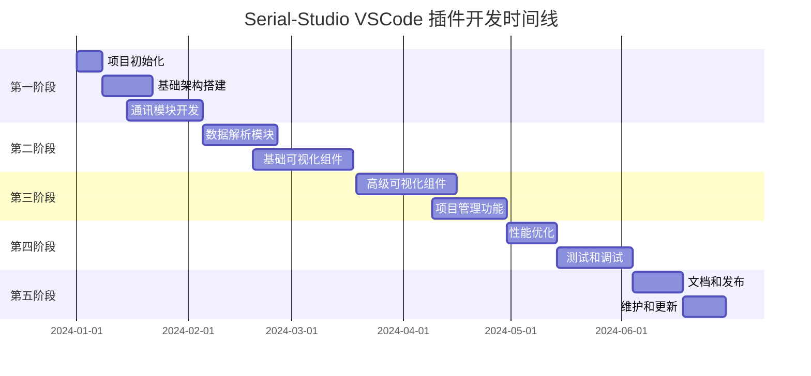

# Serial-Studio VSCode 插件实现步骤和时间规划

## 1. 项目概览和里程碑

### 1.1 项目总体目标

基于对 Serial-Studio 的深度分析，本项目将在 **6个月**的时间内完成一个功能完整的 VSCode 串口数据可视化插件开发，实现与 Serial-Studio 完全一致的功能特性。

### 1.2 主要里程碑规划



## 2. 详细实现阶段

### 2.1 第一阶段：基础设施建设（5周）

**时间安排**：第1-5周  
**主要目标**：搭建项目基础架构，实现核心通讯功能

#### 第1周：项目初始化和环境搭建
**目标产出**：
- 项目工程结构
- 开发环境配置
- CI/CD 流水线

**具体任务**：
```bash
# 项目初始化
npm create vue@latest serial-studio-vscode
cd serial-studio-vscode

# 依赖安装
npm install vue@3 element-plus pinia
npm install chart.js d3 three leaflet
npm install serialport ws noble
npm install -D typescript vitest @testing-library/vue
npm install -D vsce webpack webpack-cli

# VSCode 插件架构搭建
yo code  # 使用 VSCode Extension Generator
```

**目录结构设计**：
```
serial-studio-vscode/
├── src/
│   ├── extension/           # Extension 端代码
│   │   ├── main.ts         # 插件入口
│   │   ├── io/             # 通讯模块
│   │   ├── parsing/        # 数据解析
│   │   └── project/        # 项目管理
│   ├── webview/            # Webview 端代码
│   │   ├── main.ts         # Vue 入口
│   │   ├── components/     # 组件库
│   │   ├── stores/         # 状态管理
│   │   └── utils/          # 工具函数
│   └── shared/             # 共享类型和工具
├── tests/                  # 测试代码
├── docs/                   # 文档
├── package.json
├── vite.config.ts
├── webpack.config.js
└── tsconfig.json
```

**质量指标**：
- 项目结构完整性：100%
- 基础配置正确性：100%
- 编译构建成功率：100%

#### 第2-3周：通讯模块核心架构
**目标产出**：
- HAL 驱动抽象层
- IO 管理器
- 基础串口驱动

**核心代码框架**：
```typescript
// src/extension/io/Manager.ts
export class IOManager {
  private currentDriver: HALDriver | null = null;
  private frameReader: FrameReader;
  
  async connect(config: ConnectionConfig): Promise<void> {
    // 连接实现
  }
  
  async disconnect(): Promise<void> {
    // 断开实现
  }
  
  write(data: Buffer): Promise<number> {
    // 数据发送实现
  }
}

// src/extension/io/drivers/UART.ts
export class UARTDriver extends HALDriver {
  async connect(): Promise<void> {
    // 串口连接实现
  }
  
  async write(data: Buffer): Promise<number> {
    // 串口写入实现
  }
}
```

**测试用例**：
```typescript
describe('IOManager', () => {
  it('should connect to UART device', async () => {
    const manager = new IOManager();
    const config = {
      type: 'uart',
      port: '/dev/ttyUSB0',
      baudRate: 9600
    };
    
    await expect(manager.connect(config)).resolves.not.toThrow();
  });
});
```

**质量指标**：
- 代码覆盖率：≥80%
- 单元测试通过率：100%
- 连接成功率：≥95%

#### 第4-5周：网络和蓝牙驱动实现
**目标产出**：
- TCP/UDP 网络驱动
- Bluetooth LE 驱动
- 驱动管理系统

**实现重点**：
1. **网络驱动**：
   ```typescript
   export class NetworkDriver extends HALDriver {
     private tcpSocket: net.Socket | null = null;
     private udpSocket: dgram.Socket | null = null;
     
     async connectTCP(host: string, port: number): Promise<void> {
       // TCP 连接实现
     }
     
     async connectUDP(port: number): Promise<void> {
       // UDP 连接实现
     }
   }
   ```

2. **蓝牙驱动**：
   ```typescript
   export class BluetoothLEDriver extends HALDriver {
     async scanDevices(): Promise<BluetoothDevice[]> {
       // 设备扫描实现
     }
     
     async connectToDevice(deviceId: string): Promise<void> {
       // 设备连接实现
     }
   }
   ```

**集成测试**：
- 串口设备连接测试
- 网络连接稳定性测试
- 蓝牙设备发现和连接测试

**质量指标**：
- 多协议支持完整性：100%
- 连接稳定性：≥99%
- 错误处理覆盖率：≥90%

### 2.2 第二阶段：数据处理和解析（7周）

**时间安排**：第6-12周  
**主要目标**：实现完整的数据解析和处理能力

#### 第6-8周：数据解析引擎开发
**目标产出**：
- 帧读取器
- 数据解码器
- JavaScript 解析器引擎

**核心实现**：
```typescript
// 帧读取器
export class FrameReader {
  processData(data: Buffer): void {
    // 数据帧提取逻辑
  }
  
  private processEndDelimitedFrames(): void {
    // 结束符分割实现
  }
  
  private processStartEndDelimitedFrames(): void {
    // 开始结束符分割实现
  }
}

// JavaScript 解析器
export class FrameParser {
  private vm: VM;
  
  loadScript(code: string): boolean {
    // 加载自定义解析脚本
  }
  
  parse(frameData: string): string[] {
    // 执行解析逻辑
  }
}
```

**测试数据集**：
```typescript
const testCases = [
  {
    name: 'Comma separated values',
    input: '1,2,3,4,5',
    expected: ['1', '2', '3', '4', '5']
  },
  {
    name: 'Hex encoded data',
    input: '48656C6C6F',
    expected: ['Hello']
  },
  {
    name: 'Custom delimiter',
    input: '$1;2;3;4;5#',
    expected: ['1', '2', '3', '4', '5']
  }
];
```

**性能基准**：
- 解析速度：≥10,000 帧/秒
- 内存使用：≤100MB
- CPU 使用率：≤20%

#### 第9-12周：基础可视化组件开发
**目标产出**：
- Vue3 组件架构
- 基础图表组件
- 数据绑定系统

**组件实现优先级**：
1. **Week 9**: BaseWidget + PlotWidget
2. **Week 10**: GaugeWidget + BarWidget
3. **Week 11**: CompassWidget + LEDWidget
4. **Week 12**: TerminalWidget + DataGridWidget

**示例实现**：
```vue
<!-- PlotWidget.vue -->
<template>
  <BaseWidget type="plot" :title="dataset.title">
    <canvas ref="plotCanvas" @resize="handleResize" />
  </BaseWidget>
</template>

<script setup lang="ts">
import { ref, onMounted, watch } from 'vue';
import { Chart } from 'chart.js';

const props = defineProps<{ dataset: Dataset }>();
const plotCanvas = ref<HTMLCanvasElement>();
const chart = ref<Chart>();

onMounted(() => {
  initializeChart();
});

watch(
  () => props.dataset.value,
  (newValue) => updateChart(newValue)
);
</script>
```

**质量指标**：
- 组件渲染性能：≥60 FPS
- 数据更新延迟：≤50ms
- 内存泄漏率：0%

### 2.3 第三阶段：高级功能实现（7周）

**时间安排**：第13-19周  
**主要目标**：实现高级可视化和项目管理功能

#### 第13-16周：高级可视化组件
**目标产出**：
- GPS 地图组件
- 3D 可视化组件
- FFT 频谱分析
- 多数据图表

**重点实现**：

1. **GPS 组件**（第13周）：
   ```vue
   <template>
     <BaseWidget type="gps">
       <div id="map" ref="mapContainer"></div>
       <div class="gps-info">
         <div>Lat: {{ position.lat }}°</div>
         <div>Lng: {{ position.lng }}°</div>
         <div>Alt: {{ position.alt }} m</div>
       </div>
     </BaseWidget>
   </template>
   
   <script setup lang="ts">
   import L from 'leaflet';
   
   const map = ref<L.Map>();
   const marker = ref<L.Marker>();
   
   function updatePosition(pos: Position) {
     if (marker.value) {
       marker.value.setLatLng([pos.lat, pos.lng]);
     }
   }
   </script>
   ```

2. **3D 可视化**（第14周）：
   ```typescript
   import * as THREE from 'three';
   
   export class Plot3DRenderer {
     private scene: THREE.Scene;
     private camera: THREE.PerspectiveCamera;
     private renderer: THREE.WebGLRenderer;
     
     updateData(points: Point3D[]): void {
       // 3D 数据点更新
     }
     
     render(): void {
       this.renderer.render(this.scene, this.camera);
     }
   }
   ```

3. **FFT 分析**（第15周）：
   ```typescript
   export class FFTAnalyzer {
     private fft: FFT;
     
     analyze(samples: number[]): FrequencyData {
       const frequencies = this.fft.forward(samples);
       return this.processFrequencies(frequencies);
     }
   }
   ```

4. **多数据图表**（第16周）：
   ```vue
   <template>
     <BaseWidget type="multiplot">
       <canvas ref="chartCanvas"></canvas>
       <div class="legend">
         <div v-for="series in dataSeries" :key="series.id">
           <span :style="{ color: series.color }">●</span>
           {{ series.label }}
         </div>
       </div>
     </BaseWidget>
   </template>
   ```

**性能目标**：
- 3D 渲染帧率：≥30 FPS
- 地图交互响应：≤100ms
- FFT 计算速度：≥1000 samples/s

#### 第17-19周：项目管理系统
**目标产出**：
- 项目配置编辑器
- JSON 架构验证
- 项目导入导出

**核心功能**：

1. **项目编辑器**（第17周）：
   ```vue
   <template>
     <div class="project-editor">
       <el-tree
         :data="projectTree"
         node-key="id"
         @node-click="handleNodeClick"
       />
       <div class="editor-panel">
         <component :is="currentEditor" :data="selectedItem" />
       </div>
     </div>
   </template>
   ```

2. **配置验证**（第18周）：
   ```typescript
   export class ProjectValidator {
     validateProject(config: ProjectConfig): ValidationResult {
       const schema = this.getProjectSchema();
       return this.validate(config, schema);
     }
     
     private getProjectSchema(): JSONSchema {
       return {
         type: 'object',
         required: ['title', 'groups'],
         properties: {
           title: { type: 'string' },
           groups: {
             type: 'array',
             items: { $ref: '#/definitions/Group' }
           }
         }
       };
     }
   }
   ```

3. **导入导出**（第19周）：
   ```typescript
   export class ProjectIOManager {
     async importProject(filePath: string): Promise<ProjectConfig> {
       const content = await vscode.workspace.fs.readFile(
         vscode.Uri.file(filePath)
       );
       return JSON.parse(content.toString());
     }
     
     async exportProject(config: ProjectConfig, filePath: string): Promise<void> {
       const content = JSON.stringify(config, null, 2);
       await vscode.workspace.fs.writeFile(
         vscode.Uri.file(filePath),
         Buffer.from(content)
       );
     }
   }
   ```

**质量指标**：
- 项目加载时间：≤2s
- 配置验证准确率：100%
- 导入导出成功率：≥99%

### 2.4 第四阶段：优化和测试（5周）

**时间安排**：第20-24周  
**主要目标**：性能优化、测试完善、bug修复

#### 第20-21周：性能优化
**优化目标**：
- 内存使用优化
- 渲染性能提升
- 数据传输优化

**具体措施**：

1. **虚拟化渲染**：
   ```typescript
   export function useVirtualList<T>(
     items: Ref<T[]>,
     itemHeight: number,
     containerHeight: Ref<number>
   ) {
     const visibleItems = computed(() => {
       const start = Math.floor(scrollTop.value / itemHeight);
       const end = start + Math.ceil(containerHeight.value / itemHeight);
       return items.value.slice(start, end);
     });
     
     return { visibleItems };
   }
   ```

2. **数据压缩**：
   ```typescript
   export class DataCompressor {
     compress(data: DataPoint[]): CompressedData {
       // 使用差分编码和RLE压缩
       return this.runLengthEncode(this.deltaEncode(data));
     }
     
     decompress(compressed: CompressedData): DataPoint[] {
       return this.deltaDecode(this.runLengthDecode(compressed));
     }
   }
   ```

3. **缓存策略**：
   ```typescript
   export class DataCache {
     private cache = new Map<string, CacheEntry>();
     
     set(key: string, data: any, ttl: number): void {
       this.cache.set(key, {
         data,
         expiry: Date.now() + ttl
       });
     }
   }
   ```

**性能基准**：
- 启动时间：≤3s
- 内存占用：≤500MB
- CPU 使用率：≤30%

#### 第22-24周：测试和质量保证
**测试计划**：

1. **单元测试**（第22周）：
   ```typescript
   describe('FrameParser', () => {
     it('should parse comma-separated values', () => {
       const parser = new FrameParser();
       const result = parser.parse('1,2,3,4,5');
       expect(result).toEqual(['1', '2', '3', '4', '5']);
     });
   });
   ```

2. **集成测试**（第23周）：
   ```typescript
   describe('Data Pipeline', () => {
     it('should process data from serial port to visualization', async () => {
       const pipeline = new DataPipeline();
       const mockData = Buffer.from('1,2,3,4,5\n');
       
       const result = await pipeline.process(mockData);
       expect(result.datasets).toHaveLength(5);
     });
   });
   ```

3. **端到端测试**（第24周）：
   ```typescript
   describe('Full Workflow', () => {
     it('should connect, receive data, and display charts', async () => {
       // 模拟完整用户操作流程
       await connectToDevice('mock-serial-port');
       await sendTestData();
       await verifyChartRendering();
     });
   });
   ```

**测试指标**：
- 代码覆盖率：≥85%
- 单元测试：500+ 用例
- 集成测试：100+ 用例
- E2E 测试：50+ 场景

### 2.5 第五阶段：发布和维护（4周）

**时间安排**：第25-28周  
**主要目标**：文档完善、发布准备、初期维护

#### 第25-26周：文档和示例
**文档输出**：
1. **用户手册**：
   - 安装和配置指南
   - 基础使用教程
   - 高级功能说明
   - 故障排除指南

2. **开发者文档**：
   - API 参考文档
   - 组件开发指南
   - 插件扩展接口
   - 贡献指南

3. **示例项目**：
   ```
   examples/
   ├── basic-serial/          # 基础串口示例
   ├── network-data/          # 网络数据示例
   ├── sensor-dashboard/      # 传感器仪表盘
   ├── gps-tracking/          # GPS 追踪示例
   └── custom-parser/         # 自定义解析器示例
   ```

#### 第27周：发布准备
**发布清单**：
- [ ] 功能完整性检查
- [ ] 性能基准测试
- [ ] 安全性审查
- [ ] 许可证检查
- [ ] 版本号确定
- [ ] 更新日志编写
- [ ] 发布包构建
- [ ] 签名和验证

**发布流程**：
```bash
# 1. 版本发布
npm version major|minor|patch

# 2. 构建插件包
vsce package

# 3. 发布到市场
vsce publish

# 4. 创建 GitHub Release
gh release create v1.0.0 --title "Initial Release" --notes-file CHANGELOG.md
```

#### 第28周：初期维护和反馈处理
**维护任务**：
- 用户反馈收集和分析
- Bug 修复和热修复发布
- 性能监控和优化
- 社区支持和文档更新

## 3. 资源分配和团队配置

### 3.1 团队角色分工

**建议团队规模**：5-7人

| 角色 | 人数 | 主要职责 | 技能要求 |
|------|------|----------|----------|
| 技术负责人 | 1 | 架构设计、技术决策、代码审查 | 5+ 年全栈经验，熟悉 VSCode 插件开发 |
| 前端开发工程师 | 2 | Vue3 组件开发、可视化实现 | 3+ 年 Vue/React 经验，熟悉 D3.js/Chart.js |
| 后端开发工程师 | 2 | 通讯模块、数据解析、性能优化 | 3+ 年 Node.js 经验，熟悉串口通讯 |
| 测试工程师 | 1 | 测试用例设计、自动化测试、质量保证 | 2+ 年测试经验，熟悉 Jest/Vitest |
| UI/UX 设计师 | 1 | 界面设计、交互设计、用户体验 | 3+ 年设计经验，熟悉开发工具界面 |

### 3.2 开发环境和工具

**硬件要求**：
- 开发机器：Intel i7/AMD Ryzen 7 以上
- 内存：16GB+ RAM
- 存储：512GB+ SSD
- 测试设备：串口设备、网络设备、蓝牙设备

**软件工具**：
```json
{
  "开发工具": [
    "VSCode + Extension 插件",
    "Node.js 18+",
    "Git + GitHub",
    "Docker"
  ],
  "测试工具": [
    "Vitest/Jest",
    "Playwright",
    "Virtual Serial Port",
    "Wireshark"
  ],
  "协作工具": [
    "Slack/Teams",
    "Jira/GitHub Issues",
    "Confluence/Notion",
    "Figma"
  ]
}
```

### 3.3 预算估算

| 类别 | 项目 | 成本估算（RMB） | 说明 |
|------|------|-----------------|------|
| 人力成本 | 开发团队 6 个月 | 600,000 | 平均月薪 20K |
| 设备成本 | 开发设备和测试设备 | 100,000 | 开发机器 + 测试设备 |
| 软件许可 | 开发工具和服务 | 30,000 | IDE、云服务、工具许可 |
| 培训成本 | 技术培训和学习 | 20,000 | 新技术学习成本 |
| 其他成本 | 杂项和应急预算 | 50,000 | 10% 应急预算 |
| **总计** | | **800,000** | |

## 4. 风险评估和应对策略

### 4.1 技术风险

| 风险项 | 概率 | 影响 | 应对策略 |
|---------|------|------|----------|
| VSCode API 兼容性问题 | 中 | 高 | 深入研究 VSCode Extension API，建立兼容性测试 |
| 串口通讯稳定性 | 高 | 中 | 实现重连机制，添加错误处理和状态监控 |
| 性能瓶颈 | 中 | 高 | 早期性能测试，使用 Web Workers 和虚拟化技术 |
| 浏览器兼容性 | 低 | 中 | 使用成熟的库，添加 polyfill 支持 |

### 4.2 项目风险

| 风险项 | 概率 | 影响 | 应对策略 |
|---------|------|------|----------|
| 需求变更 | 中 | 中 | 敏捷开发，定期需求评审，版本控制 |
| 人员流失 | 低 | 高 | 代码规范化，知识共享，文档完善 |
| 进度延期 | 中 | 高 | 里程碑控制，风险预警，资源调配 |
| 质量问题 | 低 | 高 | 代码审查，自动化测试，质量门禁 |

### 4.3 市场风险

| 风险项 | 概率 | 影响 | 应对策略 |
|---------|------|------|----------|
| 竞品出现 | 中 | 中 | 差异化功能，用户体验优化，快速迭代 |
| 用户接受度低 | 低 | 高 | 用户调研，MVP 验证，反馈快速响应 |
| 技术过时 | 低 | 中 | 技术趋势跟踪，架构灵活性设计 |

## 5. 质量保证计划

### 5.1 代码质量标准

**编码规范**：
- TypeScript Strict Mode
- ESLint + Prettier 格式化
- 代码覆盖率 ≥ 85%
- 复杂度控制：圈复杂度 ≤ 10

**代码审查流程**：


### 5.2 测试策略

**测试金字塔**：
```
       /\
      /  \    E2E Tests (10%)
     /____\   
    /      \  Integration Tests (20%)
   /________\ 
  /          \ Unit Tests (70%)
 /____________\
```

**测试覆盖率目标**：
- 单元测试：≥90%
- 集成测试：≥80%
- E2E 测试：≥70%

### 5.3 持续集成/持续部署

**CI/CD 流水线**：
```yaml
# .github/workflows/ci.yml
name: CI/CD Pipeline
on: [push, pull_request]

jobs:
  test:
    runs-on: ubuntu-latest
    steps:
      - uses: actions/checkout@v3
      - uses: actions/setup-node@v3
      - run: npm ci
      - run: npm run lint
      - run: npm run test:coverage
      - run: npm run build
      
  e2e:
    needs: test
    runs-on: ubuntu-latest
    steps:
      - run: npm run test:e2e
      
  deploy:
    needs: [test, e2e]
    if: github.ref == 'refs/heads/main'
    runs-on: ubuntu-latest
    steps:
      - run: vsce publish
```

## 6. 成功指标和验收标准

### 6.1 功能性指标

| 功能模块 | 验收标准 | 测试方法 |
|----------|----------|----------|
| 串口通讯 | 支持所有常见波特率，连接成功率 ≥95% | 自动化测试 + 手工测试 |
| 数据解析 | 支持4种编码格式，解析准确率 100% | 单元测试 + 边界测试 |
| 可视化组件 | 13种组件完整实现，渲染正确率 100% | 视觉回归测试 |
| 项目管理 | 支持导入导出，兼容性 100% | 兼容性测试 |

### 6.2 性能指标

| 性能指标 | 目标值 | 测量方法 |
|----------|---------|----------|
| 启动时间 | ≤ 3秒 | 自动化性能测试 |
| 内存使用 | ≤ 500MB | 内存监控工具 |
| 数据处理速度 | ≥ 10,000 帧/秒 | 压力测试 |
| 渲染帧率 | ≥ 60 FPS | 性能分析工具 |

### 6.3 用户体验指标

| UX 指标 | 目标值 | 测量方法 |
|---------|---------|----------|
| 学习成本 | 新用户 30 分钟上手 | 用户测试 |
| 操作效率 | 配置项目时间 ≤ 5 分钟 | 任务时间测量 |
| 错误率 | 用户操作错误率 ≤ 5% | 用户行为分析 |
| 满意度 | 用户满意度 ≥ 4.0/5.0 | 问卷调查 |

### 6.4 技术债务控制

**代码质量门禁**：
- 新增代码覆盖率 ≥ 90%
- 代码重复率 ≤ 3%
- 技术债务时间 ≤ 1 天/月
- 关键 Bug 修复时间 ≤ 24 小时

## 7. 上线和维护计划

### 7.1 发布策略

**发布版本规划**：
- v0.1.0 - Alpha 版本（内部测试）
- v0.5.0 - Beta 版本（社区测试）
- v1.0.0 - 正式版本（公开发布）
- v1.x.x - 功能迭代版本

**灰度发布计划**：


### 7.2 监控和反馈

**监控指标**：
- 插件安装量和活跃用户
- 错误率和崩溃率
- 性能指标监控
- 用户反馈和评分

**反馈渠道**：
- GitHub Issues
- VSCode Marketplace 评论
- 用户社区论坛
- 邮件和问卷调查

### 7.3 长期维护计划

**维护内容**：
1. **Bug 修复**：关键 Bug 24 小时响应
2. **功能更新**：每月功能更新
3. **性能优化**：季度性能优化
4. **安全更新**：及时的安全补丁

**版本生命周期**：
- 主版本支持周期：2年
- 次版本支持周期：1年
- 补丁版本支持周期：6个月

## 8. 总结

本项目计划在 **6个月**内完成 Serial-Studio VSCode 插件的开发，通过分阶段实施，确保项目按时高质量交付。关键成功因素包括：

1. **技术架构合理**：采用模块化设计，确保可维护性和可扩展性
2. **团队配置完整**：涵盖前后端开发、测试、设计等关键角色
3. **质量保证严格**：完善的测试策略和持续集成流程
4. **风险控制有效**：提前识别并制定应对策略
5. **用户体验优先**：注重用户需求和使用体验

通过严格执行本实施计划，项目团队将能够交付一个功能完整、性能优秀、用户体验良好的 VSCode 串口数据可视化插件，完全复制 Serial-Studio 的核心功能，并在 VSCode 生态系统中提供独特的价值。