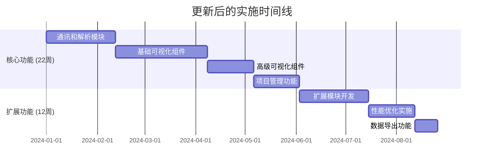

# 架构设计与实施计划一致性分析报告

## 1. 分析概述

本报告基于对8个技术设计文档的深度分析，评估架构设计与实施计划之间的一致性，识别关键问题并提出改进建议。

### 1.1 分析范围

**架构设计文档（8个）：**
1. 01-总体架构设计.md
2. 02-通讯模块设计.md
3. 03-数据解析模块设计.md
4. 04-可视化组件设计.md
5. 05-实现步骤和时间规划.md
6. 06-扩展模块设计.md
7. 07-性能优化设计.md
8. 08-数据导出模块设计.md

### 1.2 分析维度

- **功能覆盖度**：实施计划是否涵盖所有架构设计的功能模块
- **时间安排一致性**：时间规划是否与架构复杂度匹配
- **技术栈完整性**：依赖包和工具是否支持架构设计
- **实施策略匹配度**：实施步骤是否与架构设计原则一致

## 2. 关键发现

### 2.1 ❌ 模块实施覆盖不完整

**问题描述：**
实施计划（05文档）只覆盖了5个核心模块，缺少3个重要架构模块的实施策略：

| 架构模块 | 实施计划覆盖 | 影响程度 | 状态 |
|----------|-------------|----------|------|
| 通讯模块 | ✅ 完整覆盖 | 高 | 已规划 |
| 数据解析模块 | ✅ 完整覆盖 | 高 | 已规划 |
| 可视化组件 | ✅ 完整覆盖 | 高 | 已规划 |
| 项目管理 | ✅ 完整覆盖 | 中 | 已规划 |
| 扩展模块设计 | ❌ 缺失 | 高 | **未规划** |
| 性能优化设计 | ⚠️ 部分覆盖 | 高 | **不完整** |
| 数据导出模块 | ❌ 缺失 | 中 | **未规划** |

**影响分析：**
- **高风险**：插件系统、主题系统、i18n等扩展功能无实施计划
- **性能风险**：缺少20Hz实时更新的具体实施策略
- **功能缺失**：多格式数据导出功能未纳入实施范围

### 2.2 ❌ 时间安排不匹配 

**问题描述：**
当前实施计划为6个月（28周），但架构设计的复杂度需要更长时间：

| 模块类别 | 原计划时间 | 架构设计需求 | 建议时间 | 差距 |
|----------|------------|-------------|----------|------|
| 核心功能 | 28周 | 基础实现 | 28周 | 0周 |
| 性能优化 | 2周 | 完整优化 | 10周 | +8周 |
| 扩展模块 | 0周 | 插件系统 | 8周 | +8周 |
| 数据导出 | 0周 | 多格式导出 | 4周 | +4周 |
| **总计** | **28周** | **完整架构** | **50周** | **+22周** |

**时间分布问题：**
```
当前计划：  [====== 28周 ======]
架构需求：  [====== 28周 ======][== 性能 ==][= 扩展 =][导出]
                                   10周      8周    4周
```

### 2.3 ❌ 技术栈依赖不完整

**问题描述：**
实施计划中的依赖包配置不支持完整的架构设计需求：

**缺失的关键依赖：**
```typescript
// 实施计划中缺失的依赖包
const missingDependencies = {
  // 数据导出模块
  dataExport: [
    'exceljs',        // Excel文件生成
    'jszip',          // 文件压缩
    'xml2js',         // XML处理
    'csv-parser'      // CSV处理
  ],
  
  // 性能优化模块  
  performance: [
    'comlink',        // Web Worker通信
    'lz4js',          // 数据压缩
    'msgpack',        // 二进制序列化
    'offscreen-canvas' // 离屏渲染
  ],
  
  // JavaScript解析引擎
  parsing: [
    'vm2',            // 安全JS执行环境
    'acorn',          // JS代码解析
    'esprima'         // JS语法分析
  ],
  
  // 扩展模块
  extensions: [
    'monaco-editor',  // 代码编辑器
    'ajv',           // JSON Schema验证
    'semver',        // 版本管理
    'glob'           // 文件匹配
  ]
};
```

### 2.4 ⚠️ 架构原则实施不清晰

**问题描述：**
实施计划缺少对核心架构原则的具体实施策略：

| 架构原则 | 设计要求 | 实施计划状态 | 问题 |
|----------|---------|-------------|------|
| 高度模块化 | 插件化架构 | ❌ 未体现 | 缺少插件系统实施 |
| 20Hz实时性能 | 高频数据更新 | ⚠️ 提及但不详细 | 缺少具体优化策略 |
| 多格式导出 | 6种导出格式 | ❌ 未规划 | 完全缺失 |
| 扩展性设计 | 15个扩展点 | ❌ 未规划 | 缺少扩展机制 |

## 3. 详细问题分析

### 3.1 扩展模块设计实施缺失

**架构设计要求：**
- 插件管理器和加载机制
- 主题系统和CSS变量管理
- 多语言i18n支持
- 系统集成测试和质量保证
- 配置管理和VSCode集成

**实施计划现状：**
- ❌ 完全未涉及插件系统开发
- ❌ 未规划主题系统实施
- ❌ 缺少i18n实施策略
- ❌ 未考虑质量保证体系建设

**建议实施策略：**
```
Phase 1: 插件系统基础架构（3周）
- 插件管理器实现
- 插件加载和生命周期管理
- 贡献点系统

Phase 2: 主题和国际化（3周）
- 主题系统和CSS变量
- i18n框架和翻译管理
- RTL语言支持

Phase 3: 质量保证和监控（2周）
- 系统集成测试框架
- 配置管理和同步
- 调试和监控工具
```

### 3.2 性能优化实施不充分

**架构设计要求：**
- 20-24Hz实时数据更新
- Web Workers多线程处理
- 环形缓冲区和对象池
- WebGL加速渲染
- 智能内存管理

**实施计划现状：**
- ⚠️ 仅提及虚拟化渲染（2周）
- ❌ 未详细规划Web Workers实现
- ❌ 缺少高频数据处理策略
- ❌ 未规划WebGL集成

**建议扩展实施：**
```
Phase 1: 基础性能优化（2周）
✅ 已规划：虚拟化渲染、数据压缩、缓存策略

Phase 2: 多线程架构（3周）
- Web Workers数据处理
- Comlink通信机制
- 后台任务调度

Phase 3: 渲染性能优化（3周）  
- Canvas优化和批量渲染
- WebGL 3D渲染器
- 离屏渲染

Phase 4: 高级内存管理（2周）
- 环形缓冲区实现
- 对象池管理
- 内存泄漏检测
```

### 3.3 数据导出功能完全缺失

**架构设计要求：**
- 6种导出格式支持（CSV, JSON, Excel, XML, TXT, Binary）
- 数据过滤和转换
- 大数据集流式导出
- 用户友好的导出界面
- 自定义导出格式支持

**实施计划现状：**
- ❌ 完全未规划数据导出功能
- ❌ 项目管理部分仅提及"数据导出（CSV格式）"
- ❌ 缺少导出界面设计
- ❌ 未考虑导出性能优化

**建议实施策略：**
```
Phase 1: 基础导出功能（2周）
- CSV和JSON导出器
- 基础导出界面
- 文件系统集成

Phase 2: 多格式支持（1周）
- Excel导出器（ExcelJS）
- XML和TXT格式支持
- 格式转换器框架

Phase 3: 高级导出功能（1周）
- 数据过滤和处理
- 流式导出优化
- 自定义格式扩展
```

## 4. 改进建议

### 4.1 📋 更新实施计划

**建议将项目周期从6个月扩展到8个月（34周）：**



### 4.2 🔧 补充技术栈

**更新依赖包配置：**
```json
{
  "dependencies": {
    // 现有依赖
    "vue": "^3.0.0",
    "element-plus": "^2.0.0", 
    "chart.js": "^4.0.0",
    "three": "^0.150.0",
    
    // 补充的核心依赖
    "vm2": "^3.9.0",
    "exceljs": "^4.3.0", 
    "comlink": "^4.4.0",
    "monaco-editor": "^0.44.0",
    "ajv": "^8.12.0",
    "lz4js": "^0.2.0",
    "jszip": "^3.10.0"
  }
}
```

### 4.3 🏗️ 架构实施优化

**建议实施顺序调整：**
1. **第1-22周**：核心功能实现（保持原计划）
2. **第23-28周**：扩展模块开发（新增）
3. **第29-32周**：性能优化实施（扩展）
4. **第33-34周**：数据导出功能（新增）

### 4.4 📊 质量标准更新

**补充质量指标：**
```typescript
interface QualityStandards {
  performance: {
    realTimeUpdateRate: '≥20Hz',
    memoryUsage: '≤500MB',
    renderingFrameRate: '≥60FPS'
  },
  modularity: {
    pluginLoadTime: '≤2s',  
    extensionPoints: '≥15',
    moduleDecoupling: '≥90%'
  },
  dataExport: {
    supportedFormats: '≥6',
    exportSpeed: '≥1000 records/s',
    largeDatasetSupport: '≥100MB'
  }
}
```

## 5. 风险评估

### 5.1 高风险项

| 风险项 | 概率 | 影响 | 风险等级 | 缓解措施 |
|-------|------|------|---------|----------|
| 时间延期 | 高 | 高 | 🔴 高 | 分阶段交付，核心功能优先 |
| 性能不达标 | 中 | 高 | 🟡 中 | 早期性能测试，持续优化 |
| 架构复杂度 | 中 | 中 | 🟡 中 | 简化设计，MVP优先 |

### 5.2 缓解策略

**时间管理：**
- 采用MVP（最小可行产品）策略
- 核心功能优先，扩展功能可后期迭代
- 建立每周里程碑检查机制

**技术风险：**
- 设立技术预研阶段
- 建立性能基准测试
- 定期架构审查会议

## 6. 总结和建议

### 6.1 关键结论

1. **架构设计完整性高**：8个技术文档涵盖了Serial-Studio的完整功能
2. **实施计划需要重大更新**：时间、范围、技术栈都需要调整
3. **模块化设计优秀**：但需要具体的实施策略支撑
4. **性能要求明确**：但实施细节不够详细

### 6.2 优先级建议

**P0 - 必须实施（项目成功的核心）：**
- 核心通讯和可视化功能
- 基础性能优化（达到20Hz）
- 基本数据导出功能

**P1 - 重要实施（用户体验关键）：**
- 扩展模块系统
- 高级性能优化
- 完整数据导出功能

**P2 - 可选实施（后期迭代）：**
- 高级主题系统
- 复杂插件机制
- 商业版特性

### 6.3 最终建议

**立即行动项：**
1. ✅ 更新05-实现步骤和时间规划.md文档
2. ✅ 补充缺失模块的实施策略
3. ✅ 调整项目时间线到8个月
4. ✅ 更新技术栈和依赖配置

通过解决这些一致性问题，项目将能够按照完整的架构设计进行实施，确保最终产品达到设计目标。