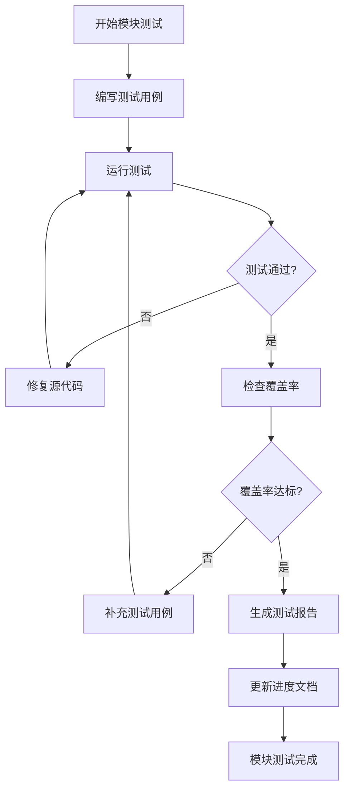

# Serial Studio VSCode 插件单元测试实施计划

## 1. 计划概览

本文档是Serial Studio VSCode插件单元测试的详细实施计划，基于7个模块测试方案制定了分阶段、可执行的测试开发和验证流程。

### 1.1 总体目标

- **测试覆盖率**：整体代码覆盖率≥95%
- **测试用例数**：总计1055个测试用例，分布在86个测试文件中
- **质量标准**：0崩溃、0内存泄漏，20Hz实时性能达标
- **完成时间**：预计8周完成所有测试开发和验证

### 1.2 模块测试分布

| 模块名称 | 测试文件数 | 测试用例数 | 覆盖率目标 | 优先级 | 预计耗时 |
|---------|-----------|-----------|-----------|--------|----------|
| 通讯模块 | 15个 | 186个 | ≥98% | P0 | 2周 |
| 数据解析模块 | 12个 | 148个 | ≥97% | P0 | 1.5周 |
| 可视化组件 | 18个 | 224个 | ≥95% | P0 | 2.5周 |
| 项目管理 | 8个 | 95个 | ≥93% | P1 | 1周 |
| 扩展模块 | 14个 | 167个 | ≥90% | P1 | 1.5周 |
| 性能优化 | 10个 | 123个 | ≥95% | P1 | 1周 |
| 数据导出 | 9个 | 112个 | ≥92% | P2 | 1周 |

## 2. 实施阶段规划

### 阶段1：测试基础设施搭建 (第1周)

#### 📋 任务清单
- [ ] **配置测试框架 (Vitest)**
  - 配置vitest.config.ts
  - 设置测试环境和全局变量
  - 配置覆盖率报告工具(c8)
  
- [ ] **创建测试工具类**
  - Mock工厂类
  - 测试数据生成器
  - 性能测试工具
  
- [ ] **建立CI/CD基础**
  - GitHub Actions 工作流配置
  - 质量门禁设置
  - 测试报告生成

#### 🎯 验收标准
- 能运行基础测试用例
- 覆盖率报告正常生成
- CI流水线能正常执行

---

### 阶段2：P0核心模块测试 (第2-6周)

#### 2.1 通讯模块测试 (第2-3周)

**📁 测试文件结构：**
```
utest/communication/
├── HALDriver.test.ts
├── UARTDriver.test.ts  
├── NetworkDriver.test.ts
├── BluetoothDriver.test.ts
├── ConnectionManager.test.ts
├── ErrorHandling.test.ts
├── PerformanceTests.test.ts
├── IntegrationTests.test.ts
└── ...
```

**🎯 测试重点：**
- HAL驱动抽象层完整性测试
- 多协议并发连接稳定性
- 错误处理和自动恢复机制
- 1MB/s数据吞吐量验证
- 内存泄漏检测

**📊 进度跟踪：**
- [ ] Week 2.1: HAL基础层测试 (60个用例)
- [ ] Week 2.2: 协议驱动测试 (80个用例) 
- [ ] Week 2.3: 集成和性能测试 (46个用例)

#### 2.2 数据解析模块测试 (第4-4.5周)

**📁 测试文件结构：**
```
utest/parsing/
├── FrameReader.test.ts
├── DataDecoder.test.ts
├── JSParserEngine.test.ts
├── SecurityTests.test.ts
├── PerformanceTests.test.ts
└── Integration.test.ts
```

**🎯 测试重点：**
- JavaScript解析引擎安全隔离
- 多种数据格式解析准确性
- VM2安全执行环境验证
- ≥10000帧/秒处理性能
- 恶意代码防护机制

**📊 进度跟踪：**
- [ ] Week 4.1: 帧提取和解码测试 (60个用例)
- [ ] Week 4.2: JS引擎安全测试 (50个用例)
- [ ] Week 4.3: 性能和集成测试 (38个用例)

#### 2.3 可视化组件测试 (第5-6.5周)

**📁 测试文件结构：**
```
utest/visualization/
├── BaseWidget.test.ts
├── PlotWidget.test.ts
├── GaugeWidget.test.ts
├── Plot3DWidget.test.ts
├── BarWidget.test.ts
├── LEDPanel.test.ts
├── DataGrid.test.ts
└── PerformanceTests.test.ts
```

**🎯 测试重点：**
- 13种可视化组件功能完整性
- 20Hz实时数据更新验证
- Vue3 Composition API兼容性
- WebGL 3D渲染性能
- 用户交互响应测试

**📊 进度跟踪：**
- [ ] Week 5.1: 基础组件测试 (80个用例)
- [ ] Week 5.2: 高级组件测试 (90个用例)
- [ ] Week 6.1: 3D和复杂组件 (54个用例)

---

### 阶段3：P1重要模块测试 (第7-9周)

#### 3.1 扩展模块测试 (第7-7.5周)

**🎯 测试重点：**
- 插件系统动态加载
- 主题系统切换
- 国际化多语言支持
- 许可证管理和特性门控

#### 3.2 性能优化模块测试 (第7.5-8周)

**🎯 测试重点：**
- Web Workers多线程处理
- 内存管理和对象池
- 实时性能监控
- 内存泄漏检测

#### 3.3 项目管理模块测试 (第8-8.5周)

**🎯 测试重点：**
- 配置文件加载和验证
- 项目数据持久化
- 设置同步机制

---

### 阶段4：P2辅助模块测试 (第8.5-9周)

#### 4.1 数据导出模块测试

**🎯 测试重点：**
- 6种导出格式转换
- 大数据集处理性能
- 流式导出机制
- 用户界面交互

---

### 阶段5：集成和系统测试 (第9-10周)

#### 5.1 模块间集成测试

**🎯 测试重点：**
- 数据流完整性验证
- 模块协作稳定性
- 错误传播控制

#### 5.2 端到端测试

**🎯 测试重点：**
- 完整用户流程验证
- VSCode API集成
- 性能基准验证

## 3. 测试执行策略

### 3.1 单个模块测试流程

对于每个模块，按以下流程执行：



### 3.2 日常工作流程

#### 每日工作流程：
1. **晨会检查** (9:00-9:15)
   - 回顾昨日完成情况
   - 确认今日测试目标
   - 协调团队资源

2. **测试开发** (9:15-12:00)
   - 编写测试用例
   - 运行和调试测试
   - 修复发现的问题

3. **代码审查** (14:00-15:00)
   - 同行评审测试代码
   - 确保测试质量

4. **进度汇报** (17:00-17:30)
   - 更新测试进度
   - 提交日报告
   - 记录问题和风险

#### 每周里程碑检查：
- 周三：中期进度检查
- 周五：周目标完成验收
- 周日：下周计划制定

### 3.3 质量保证措施

#### 代码质量检查：
```typescript
// 每次提交都必须通过以下检查
const qualityChecks = {
  typescript: "npm run type-check",
  linting: "npm run lint", 
  formatting: "npm run prettier:check",
  tests: "npm run test:unit",
  coverage: "npm run coverage:check"
};
```

#### 测试质量标准：
- **测试命名规范**：应该[预期行为]
- **测试结构**：Arrange-Act-Assert模式
- **Mock使用**：优先使用接口级Mock
- **断言质量**：每个测试≥3个有意义的断言

## 4. 风险管理

### 4.1 已识别风险

| 风险项目 | 影响程度 | 发生概率 | 缓解措施 |
|---------|---------|---------|---------|
| 性能测试不稳定 | 高 | 中 | 使用稳定基准环境，多次运行取平均值 |
| Mock复杂度过高 | 中 | 高 | 简化Mock设计，重点测试核心逻辑 |
| VSCode API变更 | 高 | 低 | 版本锁定，建立API兼容性测试 |
| 测试执行时间过长 | 中 | 中 | 并行执行，优化测试数据大小 |
| 团队技能差异 | 中 | 中 | 编写详细文档，定期技术分享 |

### 4.2 应急计划

- **进度延期**：优先保证P0模块质量，可适当降低P2模块覆盖率要求
- **技术障碍**：建立专家支持机制，外部技术咨询
- **人员变动**：文档化所有决策和实现细节

## 5. 成功标准

### 5.1 定量指标

- **覆盖率达标**：所有模块达到目标覆盖率
- **性能达标**：所有性能指标达到要求
- **稳定性达标**：24小时连续运行0崩溃
- **完成度达标**：按时完成所有测试用例

### 5.2 定性指标

- **代码质量**：通过所有静态代码检查
- **文档完整**：每个模块都有完整的测试报告
- **团队满意度**：团队成员对测试方案满意度≥8/10

## 6. 进度跟踪表

### 当前状态 (实时更新)

| 模块 | 计划用例数 | 已完成 | 通过 | 覆盖率 | 状态 |
|------|-----------|--------|------|--------|------|
| 通讯模块 | 186 | 0 | 0 | 0% | ⏸️ 待开始 |
| 数据解析 | 148 | 0 | 0 | 0% | ⏸️ 待开始 |
| 可视化组件 | 224 | 0 | 0 | 0% | ⏸️ 待开始 |
| 项目管理 | 95 | 0 | 0 | 0% | ⏸️ 待开始 |
| 扩展模块 | 167 | 0 | 0 | 0% | ⏸️ 待开始 |
| 性能优化 | 123 | 0 | 0 | 0% | ⏸️ 待开始 |
| 数据导出 | 112 | 0 | 0 | 0% | ⏸️ 待开始 |
| **总计** | **1055** | **0** | **0** | **0%** | **📋 已规划** |

### 里程碑达成情况

- [ ] **M1 - 测试基础设施** (第1周末)
- [ ] **M2 - 通讯模块测试** (第3周末)  
- [ ] **M3 - 数据解析测试** (第4.5周末)
- [ ] **M4 - 可视化测试** (第6.5周末)
- [ ] **M5 - 扩展模块测试** (第8.5周末)
- [ ] **M6 - 全模块完成** (第9周末)
- [ ] **M7 - 集成测试** (第10周末)

## 7. 下一步行动

### 立即开始的任务：
1. ✅ **创建测试基础架构**
   - 配置vitest.config.ts
   - 建立Mock工厂和测试工具

2. 🔄 **开始通讯模块测试**
   - 创建HAL驱动测试文件
   - 实现基础测试用例

3. 📋 **建立进度跟踪机制**
   - 每日更新进度表
   - 周报告生成

---

**📝 文档版本**: v1.0  
**📅 创建时间**: {当前时间}  
**👤 负责人**: 测试团队  
**🔄 更新频率**: 每日更新进度，每周更新计划  

---

> 💡 **提示**: 本计划文档将随着测试进展实时更新。每完成一个模块的测试，都会更新对应的进度状态和生成详细的测试报告。
