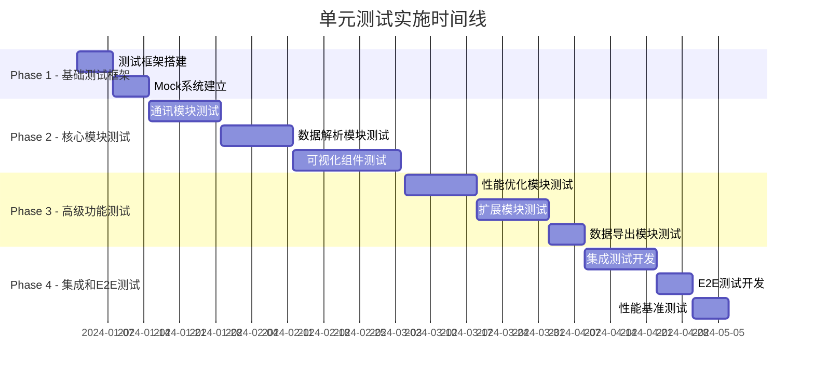

# Serial-Studio VSCode 插件单元测试总体方案

## 1. 测试方案概述

基于对Serial-Studio VSCode插件9个技术架构文档的深度分析，本文档制定了一个完整、系统、全面的单元测试方案。项目采用Vue3 + TypeScript技术栈，具有高度模块化架构和20Hz实时性能要求，需要精密的测试策略确保功能完整性和性能达标。

### 1.1 测试目标

- **功能完整性**：确保所有7大核心模块功能正确实现
- **性能达标**：验证20Hz实时更新、50ms延迟、60fps渲染等性能指标
- **稳定性保证**：长期运行无内存泄漏、无崩溃
- **兼容性验证**：多协议、多格式、多平台兼容性
- **安全性测试**：JavaScript解析引擎安全执行验证

### 1.2 测试架构设计

```
┌─────────────────────────────────────────────────────────────┐
│                    测试金字塔架构                             │
├─────────────────────────────────────────────────────────────┤
│  ┌─────────────────────────────────────────────────────────┐ │
│  │        E2E Tests (5%) - 完整用户流程测试                │ │
│  │        - 串口连接到数据可视化完整流程                     │ │
│  └─────────────────────────────────────────────────────────┘ │
├─────────────────────────────────────────────────────────────┤
│  ┌─────────────────────────────────────────────────────────┐ │
│  │     Integration Tests (15%) - 模块间集成测试             │ │
│  │     - 通讯模块与数据解析模块集成                         │ │
│  │     - 数据解析与可视化组件集成                           │ │
│  │     - WebView与Extension Host通信                       │ │
│  └─────────────────────────────────────────────────────────┘ │
├─────────────────────────────────────────────────────────────┤
│  ┌─────────────────────────────────────────────────────────┐ │
│  │        Unit Tests (80%) - 单元测试                      │ │
│  │        - 7大核心模块单元测试                             │ │
│  │        - 工具函数和辅助类测试                             │ │
│  │        - Vue组件测试                                    │ │
│  └─────────────────────────────────────────────────────────┘ │
└─────────────────────────────────────────────────────────────┘
```

## 2. 测试覆盖率要求

### 2.1 总体覆盖率目标

| 覆盖率类型 | 目标值 | 优先级 | 验证方式 |
|----------|-------|--------|----------|
| 行覆盖率 (Line Coverage) | ≥95% | P0 | Istanbul/c8 |
| 分支覆盖率 (Branch Coverage) | ≥90% | P0 | Istanbul/c8 |
| 函数覆盖率 (Function Coverage) | ≥98% | P0 | Istanbul/c8 |
| 语句覆盖率 (Statement Coverage) | ≥95% | P0 | Istanbul/c8 |

### 2.2 模块级覆盖率要求

| 核心模块 | 行覆盖率 | 分支覆盖率 | 优先级 | 原因 |
|---------|---------|-----------|--------|------|
| 通讯模块 | ≥98% | ≥95% | P0 | 核心功能，错误影响巨大 |
| 数据解析模块 | ≥97% | ≥93% | P0 | 涉及安全执行，需高覆盖 |
| 可视化组件 | ≥95% | ≥88% | P0 | 用户体验核心 |
| 项目管理 | ≥93% | ≥85% | P1 | 配置错误影响使用 |
| 扩展模块 | ≥90% | ≥80% | P1 | 插件系统稳定性 |
| 性能优化 | ≥95% | ≥90% | P1 | 性能关键路径 |
| 数据导出 | ≥92% | ≥85% | P2 | 辅助功能 |

## 3. 测试技术栈和工具链

### 3.1 核心测试框架

```typescript
interface TestingStack {
  unitTesting: {
    framework: 'Vitest 1.x',           // 快速、现代的测试框架
    assertions: '@vitest/expect',       // 断言库
    mocking: 'vi.mock',                // Mock 功能
    coverage: 'c8',                     // 覆盖率统计
    snapshots: '@vitest/snapshot'       // 快照测试
  },
  vueComponentTesting: {
    utils: '@vue/test-utils 2.x',       // Vue 组件测试工具
    environment: 'jsdom',               // DOM 环境模拟
    renderer: '@vue/server-renderer'    // 服务端渲染测试
  },
  integrationTesting: {
    framework: 'Playwright',            // E2E 测试框架
    vscodeTesting: '@vscode/test-electron', // VSCode 扩展测试
    apiTesting: 'supertest'             // API 测试
  },
  performanceTesting: {
    benchmark: 'tinybench',             // 性能基准测试
    profiling: 'v8-profiler-node',      // 性能分析
    memoryLeak: 'clinic.js'             // 内存泄漏检测
  },
  testUtilities: {
    fixtures: 'test-data-bot',          // 测试数据生成
    serialization: 'serialize-javascript', // 数据序列化
    timeTravel: 'sinon.useFakeTimers',  // 时间模拟
    randomData: 'faker.js'              // 随机数据生成
  }
}
```

### 3.2 测试环境配置

```typescript
// vitest.config.ts - 核心测试配置
export default defineConfig({
  test: {
    environment: 'jsdom',
    globals: true,
    coverage: {
      provider: 'c8',
      reporter: ['text', 'html', 'lcov'],
      include: ['src/**/*.ts', 'src/**/*.vue'],
      exclude: ['src/**/__tests__/**', 'src/**/*.test.ts'],
      thresholds: {
        global: {
          lines: 95,
          branches: 90,
          functions: 98,
          statements: 95
        },
        // 模块级阈值
        'src/communication/**': {
          lines: 98,
          branches: 95
        },
        'src/parsing/**': {
          lines: 97,
          branches: 93
        }
      }
    },
    setupFiles: ['./tests/setup.ts'],
    testTimeout: 10000,
    hookTimeout: 10000
  }
});

// tests/setup.ts - 测试环境初始化
import { vi } from 'vitest';
import { config } from '@vue/test-utils';
import ElementPlus from 'element-plus';

// 全局 Mock VSCode API
global.vscode = {
  window: {
    showInformationMessage: vi.fn(),
    showErrorMessage: vi.fn(),
    showWarningMessage: vi.fn(),
    withProgress: vi.fn(),
    createWebviewPanel: vi.fn()
  },
  workspace: {
    getConfiguration: vi.fn(),
    onDidChangeConfiguration: vi.fn()
  },
  commands: {
    registerCommand: vi.fn(),
    executeCommand: vi.fn()
  }
};

// Vue Test Utils 全局配置
config.global.plugins = [ElementPlus];
config.global.mocks = {
  $t: (key: string) => key, // i18n mock
};
```

## 4. 7大核心模块测试策略

### 4.1 通讯模块测试策略

**测试范围：**
- HAL驱动抽象层
- UART/TCP/UDP/Bluetooth LE协议实现
- 连接管理和错误处理
- 并发连接支持

**关键测试场景：**
```typescript
describe('通讯模块测试套件', () => {
  // 连接管理测试
  describe('连接管理', () => {
    test('UART连接建立和断开', async () => {});
    test('网络连接超时处理', async () => {});
    test('蓝牙设备配对流程', async () => {});
    test('并发连接管理', async () => {});
  });
  
  // 数据传输测试
  describe('数据传输', () => {
    test('大数据量传输稳定性', async () => {});
    test('数据完整性验证', async () => {});
    test('传输错误恢复机制', async () => {});
  });
  
  // 性能测试
  describe('性能指标', () => {
    test('1MB/s数据吞吐量验证', async () => {});
    test('低延迟数据传输(<50ms)', async () => {});
  });
});
```

### 4.2 数据解析模块测试策略

**测试范围：**
- JavaScript解析引擎(VM2)安全执行
- 帧检测和数据解码
- 多格式数据处理(PlainText/Hex/Base64/Binary)
- 解析性能优化

**关键测试场景：**
```typescript
describe('数据解析模块测试套件', () => {
  // JavaScript解析引擎测试
  describe('JS解析引擎', () => {
    test('安全代码执行环境隔离', () => {});
    test('恶意代码防护机制', () => {});
    test('解析脚本语法验证', () => {});
    test('内存使用限制验证', () => {});
  });
  
  // 帧检测测试
  describe('帧检测机制', () => {
    test('无分隔符帧检测', () => {});
    test('结束分隔符检测', () => {});
    test('起始结束分隔符检测', () => {});
  });
  
  // 数据格式解析测试
  describe('多格式解析', () => {
    test('十六进制数据解析', () => {});
    test('Base64编码解析', () => {});
    test('二进制数据处理', () => {});
  });
});
```

### 4.3 可视化组件测试策略

**测试范围：**
- 13种可视化组件实现
- Vue3 Composition API组件逻辑
- Canvas/WebGL渲染性能
- 实时数据更新(20Hz)

**关键测试场景：**
```typescript
describe('可视化组件测试套件', () => {
  // 基础组件测试
  describe('PlotWidget组件', () => {
    test('组件渲染和Props验证', () => {});
    test('实时数据更新(20Hz)', () => {});
    test('大数据量渲染性能', () => {});
    test('图表缩放和平移交互', () => {});
  });
  
  describe('GaugeWidget组件', () => {
    test('仪表盘数值显示准确性', () => {});
    test('动画效果和性能', () => {});
    test('阈值告警功能', () => {});
  });
  
  // 3D组件测试
  describe('Plot3DWidget组件', () => {
    test('WebGL初始化和渲染', () => {});
    test('3D场景交互控制', () => {});
    test('大量数据点渲染性能', () => {});
  });
  
  // 组件通用功能测试
  describe('组件通用功能', () => {
    test('组件导出功能', () => {});
    test('响应式布局适配', () => {});
    test('主题切换支持', () => {});
  });
});
```

### 4.4 性能优化模块测试策略

**测试范围：**
- Web Workers多线程处理
- 环形缓冲区和对象池
- 内存管理和垃圾回收
- 渲染性能优化

**关键测试场景：**
```typescript
describe('性能优化模块测试套件', () => {
  // Web Workers测试
  describe('多线程处理', () => {
    test('Worker线程数据处理能力', async () => {});
    test('主线程与Worker通信性能', async () => {});
    test('Comlink通信机制验证', async () => {});
  });
  
  // 内存管理测试
  describe('内存管理', () => {
    test('环形缓冲区性能测试', () => {});
    test('对象池回收机制', () => {});
    test('长期运行内存稳定性', async () => {});
  });
  
  // 性能监控测试
  describe('性能监控', () => {
    test('实时性能指标收集', () => {});
    test('性能阈值告警机制', () => {});
    test('自适应性能调优', () => {});
  });
});
```

## 5. 测试数据管理

### 5.1 测试数据策略

```typescript
// 测试数据生成器
class TestDataGenerator {
  // 生成串口数据模拟
  generateSerialData(config: SerialDataConfig): Buffer {
    const { format, frameSize, frameCount } = config;
    switch (format) {
      case 'plaintext':
        return this.generatePlainTextFrames(frameSize, frameCount);
      case 'hex':
        return this.generateHexFrames(frameSize, frameCount);
      case 'binary':
        return this.generateBinaryFrames(frameSize, frameCount);
    }
  }
  
  // 生成性能测试数据
  generatePerformanceTestData(dataPoints: number): Float32Array {
    const data = new Float32Array(dataPoints);
    for (let i = 0; i < dataPoints; i++) {
      data[i] = Math.sin(i * 0.1) + Math.random() * 0.1;
    }
    return data;
  }
  
  // 生成配置文件测试数据
  generateProjectConfig(): ProjectConfig {
    return {
      title: 'Test Project',
      frameParser: 'function parse(frame) { return frame.split(","); }',
      datasets: this.generateTestDatasets(5),
      widgets: this.generateTestWidgets(10)
    };
  }
}
```

### 5.2 Mock数据和服务

```typescript
// VSCode API Mock
export const mockVSCodeAPI = {
  window: {
    showInformationMessage: vi.fn().mockResolvedValue('OK'),
    showErrorMessage: vi.fn().mockResolvedValue('OK'),
    createWebviewPanel: vi.fn().mockReturnValue({
      webview: {
        postMessage: vi.fn(),
        onDidReceiveMessage: vi.fn()
      }
    })
  },
  workspace: {
    getConfiguration: vi.fn().mockReturnValue({
      get: vi.fn().mockReturnValue({}),
      update: vi.fn().mockResolvedValue(undefined)
    })
  }
};

// 串口通信Mock
export const mockSerialPort = {
  list: vi.fn().mockResolvedValue([
    { path: '/dev/ttyUSB0', manufacturer: 'Test' }
  ]),
  create: vi.fn().mockReturnValue({
    open: vi.fn().mockImplementation((callback) => callback()),
    write: vi.fn().mockImplementation((data, callback) => callback()),
    on: vi.fn(),
    close: vi.fn().mockImplementation((callback) => callback())
  })
};
```

## 6. 持续集成测试流程

### 6.1 CI/CD 测试流水线

```yaml
# .github/workflows/test.yml
name: 单元测试和覆盖率检查

on: [push, pull_request]

jobs:
  test:
    runs-on: ubuntu-latest
    strategy:
      matrix:
        node-version: [18.x, 20.x]
    
    steps:
    - uses: actions/checkout@v3
    
    - name: Setup Node.js
      uses: actions/setup-node@v3
      with:
        node-version: ${{ matrix.node-version }}
        cache: 'npm'
    
    - name: Install dependencies
      run: npm ci
    
    - name: Type checking
      run: npm run type-check
    
    - name: Lint checking
      run: npm run lint
    
    - name: Unit tests
      run: npm run test:unit --coverage
    
    - name: Integration tests
      run: npm run test:integration
    
    - name: Performance benchmarks
      run: npm run test:performance
    
    - name: Upload coverage reports
      uses: codecov/codecov-action@v3
      with:
        file: ./coverage/lcov.info
    
    - name: Coverage threshold check
      run: npm run coverage:check
```

### 6.2 质量门禁设置

```typescript
// 质量门禁配置
const qualityGates = {
  coverage: {
    lines: 95,
    branches: 90,
    functions: 98,
    statements: 95
  },
  performance: {
    unitTestDuration: 30000,      // 30秒内完成
    integrationTestDuration: 180000, // 3分钟内完成
    memoryLeakDetection: true
  },
  codeQuality: {
    eslintErrors: 0,
    tscErrors: 0,
    duplicateCodeThreshold: 3    // 重复代码率<3%
  }
};
```

## 7. 实施计划和里程碑

### 7.1 测试实施时间线



### 7.2 测试里程碑验收标准

| 里程碑 | 完成标准 | 验收标准 |
|-------|---------|----------|
| 基础测试框架 | 测试环境搭建完成 | 能运行Hello World测试 |
| 核心模块测试 | 3大核心模块测试完成 | 覆盖率达到目标值 |
| 高级功能测试 | 扩展功能测试完成 | 性能测试通过基准 |
| 集成测试 | 端到端流程测试 | 完整功能流程验证 |

## 8. 风险识别和缓解策略

### 8.1 主要测试风险

| 风险项 | 影响程度 | 发生概率 | 缓解措施 |
|-------|---------|---------|---------|
| 性能测试不稳定 | 高 | 中 | 使用稳定的基准环境 |
| Mock复杂度过高 | 中 | 高 | 简化Mock，重点测试核心逻辑 |
| 测试执行时间过长 | 中 | 中 | 并行执行，优化测试数据 |
| VSCode API变更 | 高 | 低 | 版本锁定，及时更新适配 |

### 8.2 测试质量保证

- **代码审查**：所有测试代码必须经过审查
- **测试覆盖率监控**：设置自动化覆盖率检查
- **性能回归检测**：建立性能基准比较机制
- **测试可维护性**：定期重构测试代码，保持简洁

通过这个全面的单元测试方案，将确保Serial-Studio VSCode插件的高质量交付，为用户提供稳定可靠的串口数据可视化体验。