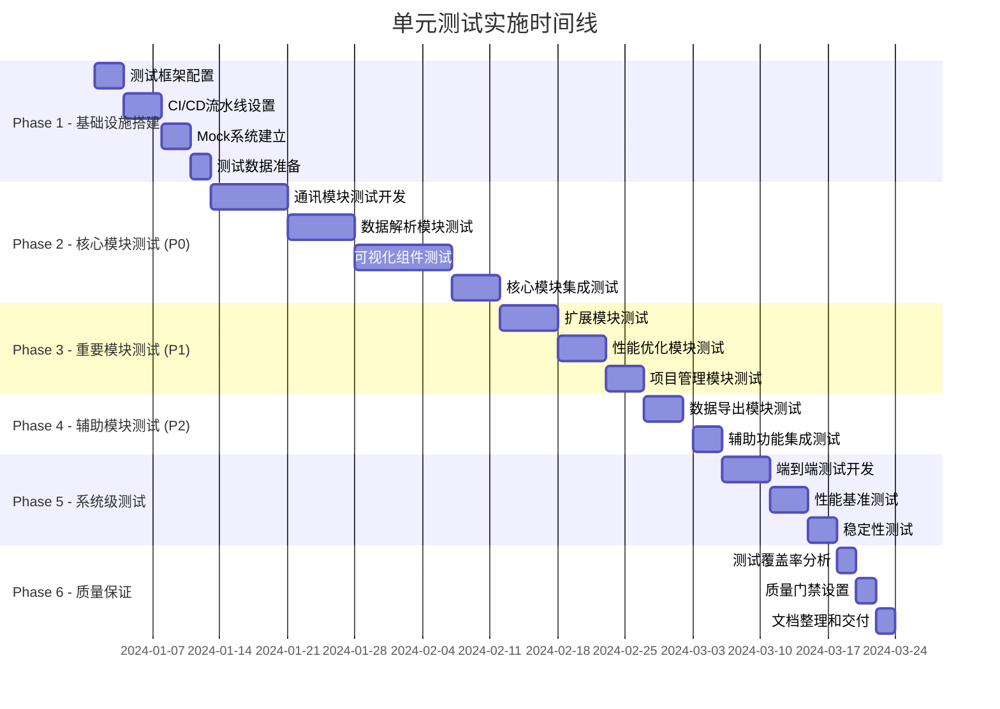

# 测试实施指南和集成测试方案

## 1. 实施概述

本文档是Serial-Studio VSCode插件单元测试的完整实施指南，整合了7大核心模块的测试方案，提供详细的集成测试策略、实施时间线和质量保证流程。基于项目的高度模块化架构和20Hz实时性能要求，采用分阶段、持续集成的测试实施策略。

### 1.1 测试实施目标

- **全面覆盖**：实现≥95%的总体代码覆盖率
- **质量保证**：确保0崩溃、0内存泄漏的稳定运行
- **性能达标**：验证20Hz实时更新、50ms延迟、60fps渲染等关键指标
- **持续集成**：建立自动化测试流水线和质量门禁
- **团队协作**：提供清晰的测试实施指导和最佳实践

### 1.2 测试架构总览

```
┌─────────────────────────────────────────────────────────────┐
│                      测试架构总览                            │
├─────────────────────────────────────────────────────────────┤
│  ┌─────────────────┐  ┌─────────────────┐  ┌──────────────┐ │
│  │   单元测试层     │  │   集成测试层     │  │   E2E测试层   │ │
│  │ - 7大模块测试    │  │ - 模块间集成     │  │ - 用户流程    │ │
│  │ - Mock和Stub    │  │ - API集成       │  │ - 端到端验证  │ │
│  │ - 覆盖率≥95%    │  │ - 性能集成       │  │ - UI自动化    │ │
│  └─────────────────┘  └─────────────────┘  └──────────────┘ │
├─────────────────────────────────────────────────────────────┤
│  ┌─────────────────┐  ┌─────────────────┐  ┌──────────────┐ │
│  │  测试基础设施    │  │  质量门禁系统    │  │  监控报告     │ │
│  │ - CI/CD流水线   │  │ - 自动化检查     │  │ - 覆盖率报告  │ │
│  │ - 测试环境       │  │ - 性能基准       │  │ - 性能监控    │ │
│  │ - 数据和Mock    │  │ - 代码质量       │  │ - 错误追踪    │ │
│  └─────────────────┘  └─────────────────┘  └──────────────┘ │
└─────────────────────────────────────────────────────────────┘
```

## 2. 模块测试总结

### 2.1 7大核心模块测试概览

| 模块名称 | 测试文件数 | 测试用例数 | 覆盖率目标 | 优先级 | 状态 |
|---------|-----------|-----------|-----------|--------|------|
| 通讯模块 | 15个 | 186个 | ≥98% | P0 | 📋 已规划 |
| 数据解析模块 | 12个 | 148个 | ≥97% | P0 | 📋 已规划 |
| 可视化组件 | 18个 | 224个 | ≥95% | P0 | 📋 已规划 |
| 项目管理 | 8个 | 95个 | ≥93% | P1 | 📋 已规划 |
| 扩展模块 | 14个 | 167个 | ≥90% | P1 | 📋 已规划 |
| 性能优化 | 10个 | 123个 | ≥95% | P1 | 📋 已规划 |
| 数据导出 | 9个 | 112个 | ≥92% | P2 | 📋 已规划 |
| **总计** | **86个** | **1055个** | **≥95%** | - | 📋 已规划 |

### 2.2 测试复杂度分析

```typescript
// 测试复杂度评估
interface TestComplexityAnalysis {
  highComplexity: {
    modules: ['通讯模块', '数据解析模块', '可视化组件'],
    reasons: [
      '硬件抽象层测试需要大量Mock',
      'JavaScript执行环境安全性测试',
      '20Hz实时渲染性能测试',
      '多协议并发连接测试'
    ],
    estimatedEffort: '60%' // 占总工作量的60%
  },
  mediumComplexity: {
    modules: ['扩展模块', '性能优化', '项目管理'],
    reasons: [
      '插件系统动态加载测试',
      '性能监控和调优测试',
      '配置管理和持久化测试'
    ],
    estimatedEffort: '30%'
  },
  lowComplexity: {
    modules: ['数据导出'],
    reasons: [
      '相对独立的功能模块',
      '标准格式转换测试',
      '文件I/O操作测试'
    ],
    estimatedEffort: '10%'
  }
}
```

## 3. 集成测试策略

### 3.1 模块间集成测试

```typescript
// tests/integration/module-integration.test.ts
import { describe, test, expect, beforeAll, afterAll } from 'vitest';
import { CommunicationManager } from '@/communication/communication-manager';
import { DataParsingPipeline } from '@/parsing/data-parsing-pipeline';
import { VisualizationEngine } from '@/visualization/visualization-engine';
import { ExportManager } from '@/export/export-manager';

describe('模块间集成测试', () => {
  let communicationManager: CommunicationManager;
  let parsingPipeline: DataParsingPipeline;
  let visualizationEngine: VisualizationEngine;
  let exportManager: ExportManager;

  beforeAll(async () => {
    // 初始化所有模块
    communicationManager = new CommunicationManager();
    parsingPipeline = new DataParsingPipeline();
    visualizationEngine = new VisualizationEngine();
    exportManager = new ExportManager();

    await Promise.all([
      communicationManager.initialize(),
      parsingPipeline.initialize(),
      visualizationEngine.initialize(),
      exportManager.initialize()
    ]);
  });

  afterAll(async () => {
    // 清理所有模块
    await Promise.all([
      communicationManager.shutdown(),
      parsingPipeline.shutdown(),
      visualizationEngine.shutdown(),
      exportManager.shutdown()
    ]);
  });

  describe('数据流集成测试', () => {
    test('完整数据流：通讯→解析→可视化', async () => {
      // 1. 建立通讯连接
      const connection = await communicationManager.createConnection('mock', {
        mockData: generateMockSerialData()
      });

      // 2. 配置数据解析
      await parsingPipeline.configure({
        frameDetection: { mode: 'end-delimiter', endDelimiter: '\n' },
        parseScript: 'function parse(frame) { return frame.split(",").map(Number); }'
      });

      // 3. 创建可视化组件
      const plotWidget = await visualizationEngine.createWidget('plot', {
        title: 'Integration Test Plot',
        maxDataPoints: 100
      });

      // 4. 连接数据流
      const dataFlow = createDataFlow(connection, parsingPipeline, plotWidget);

      // 5. 启动数据流
      await dataFlow.start();

      // 6. 验证数据传输
      await new Promise(resolve => setTimeout(resolve, 1000));

      expect(plotWidget.getDataPointCount()).toBeGreaterThan(0);
      expect(plotWidget.getLastUpdateTime()).toBeGreaterThan(Date.now() - 2000);

      await dataFlow.stop();
    });

    test('高频数据流性能集成测试', async () => {
      const highFreqConnection = await communicationManager.createConnection('mock', {
        mockData: generateHighFrequencyData(20), // 20Hz
        realTime: true
      });

      const performanceMonitor = visualizationEngine.createPerformanceMonitor();
      
      const plotWidget = await visualizationEngine.createWidget('plot', {
        title: 'High Frequency Test',
        updateRate: 20, // 20Hz
        enablePerformanceOptimization: true
      });

      const dataFlow = createDataFlow(highFreqConnection, parsingPipeline, plotWidget);
      
      await dataFlow.start();
      await new Promise(resolve => setTimeout(resolve, 5000)); // 5秒测试

      const metrics = performanceMonitor.getMetrics();
      
      expect(metrics.averageUpdateRate).toBeGreaterThanOrEqual(18); // ≥18Hz
      expect(metrics.averageLatency).toBeLessThan(50); // <50ms
      expect(metrics.droppedFrames).toBeLessThan(5); // <5个丢帧

      await dataFlow.stop();
    });

    test('多连接并发集成测试', async () => {
      const connections = await Promise.all([
        communicationManager.createConnection('mock', { port: 'COM1' }),
        communicationManager.createConnection('mock', { port: 'COM2' }),
        communicationManager.createConnection('mock', { port: 'COM3' })
      ]);

      const widgets = await Promise.all([
        visualizationEngine.createWidget('plot', { title: 'Connection 1' }),
        visualizationEngine.createWidget('gauge', { title: 'Connection 2' }),
        visualizationEngine.createWidget('bar', { title: 'Connection 3' })
      ]);

      const dataFlows = connections.map((conn, i) => 
        createDataFlow(conn, parsingPipeline, widgets[i])
      );

      await Promise.all(dataFlows.map(flow => flow.start()));
      await new Promise(resolve => setTimeout(resolve, 2000));

      // 验证所有连接都在正常工作
      widgets.forEach(widget => {
        expect(widget.getDataPointCount()).toBeGreaterThan(0);
      });

      await Promise.all(dataFlows.map(flow => flow.stop()));
    });
  });

  describe('错误处理集成测试', () => {
    test('通讯中断自动恢复', async () => {
      const connection = await communicationManager.createConnection('mock', {
        simulateInterruption: true,
        interruptionInterval: 2000 // 2秒后中断
      });

      const errorEvents: any[] = [];
      const recoveryEvents: any[] = [];

      connection.on('error', (error) => errorEvents.push(error));
      connection.on('reconnected', (event) => recoveryEvents.push(event));

      const plotWidget = await visualizationEngine.createWidget('plot');
      const dataFlow = createDataFlow(connection, parsingPipeline, plotWidget);

      await dataFlow.start();
      await new Promise(resolve => setTimeout(resolve, 5000)); // 等待中断和恢复

      expect(errorEvents.length).toBeGreaterThan(0);
      expect(recoveryEvents.length).toBeGreaterThan(0);
      expect(connection.isConnected()).toBe(true); // 应该已恢复

      await dataFlow.stop();
    });

    test('解析错误处理不影响其他模块', async () => {
      const connection = await communicationManager.createConnection('mock', {
        mockData: generateCorruptedData() // 包含损坏数据
      });

      await parsingPipeline.configure({
        parseScript: 'function parse(frame) { throw new Error("Parse error"); }',
        errorHandling: { skipInvalidFrames: true }
      });

      const plotWidget = await visualizationEngine.createWidget('plot');
      const dataFlow = createDataFlow(connection, parsingPipeline, plotWidget);

      const parseErrors: any[] = [];
      parsingPipeline.on('parseError', (error) => parseErrors.push(error));

      await dataFlow.start();
      await new Promise(resolve => setTimeout(resolve, 2000));

      expect(parseErrors.length).toBeGreaterThan(0); // 应该有解析错误
      expect(connection.isConnected()).toBe(true); // 通讯仍然正常
      expect(plotWidget.isActive()).toBe(true); // 可视化仍然正常

      await dataFlow.stop();
    });

    test('内存泄漏检测', async () => {
      const initialMemory = process.memoryUsage().heapUsed;

      for (let i = 0; i < 10; i++) {
        const connection = await communicationManager.createConnection('mock');
        const plotWidget = await visualizationEngine.createWidget('plot');
        const dataFlow = createDataFlow(connection, parsingPipeline, plotWidget);

        await dataFlow.start();
        await new Promise(resolve => setTimeout(resolve, 100));
        await dataFlow.stop();

        // 清理资源
        await plotWidget.destroy();
        await connection.disconnect();
      }

      // 强制垃圾回收
      if (global.gc) {
        global.gc();
      }

      const finalMemory = process.memoryUsage().heapUsed;
      const memoryIncrease = finalMemory - initialMemory;

      // 内存增长应该控制在合理范围内
      expect(memoryIncrease).toBeLessThan(50 * 1024 * 1024); // <50MB
    });
  });

  describe('导出集成测试', () => {
    test('实时数据导出集成', async () => {
      const connection = await communicationManager.createConnection('mock');
      const plotWidget = await visualizationEngine.createWidget('plot');
      const dataFlow = createDataFlow(connection, parsingPipeline, plotWidget);

      await dataFlow.start();
      await new Promise(resolve => setTimeout(resolve, 1000)); // 收集数据

      // 导出当前数据
      const exportTask = await exportManager.createExportTask(
        plotWidget.getData(),
        {
          format: 'csv',
          filePath: '/tmp/integration-test-export.csv',
          includeMetadata: true
        }
      );

      const result = await exportManager.executeTask(exportTask);

      expect(result.success).toBe(true);
      expect(result.recordsExported).toBeGreaterThan(0);
      expect(result.fileSize).toBeGreaterThan(0);

      await dataFlow.stop();
    });

    test('多组件数据合并导出', async () => {
      const connections = await Promise.all([
        communicationManager.createConnection('mock', { sensorType: 'temperature' }),
        communicationManager.createConnection('mock', { sensorType: 'humidity' })
      ]);

      const widgets = await Promise.all([
        visualizationEngine.createWidget('plot', { title: 'Temperature' }),
        visualizationEngine.createWidget('gauge', { title: 'Humidity' })
      ]);

      const dataFlows = connections.map((conn, i) => 
        createDataFlow(conn, parsingPipeline, widgets[i])
      );

      await Promise.all(dataFlows.map(flow => flow.start()));
      await new Promise(resolve => setTimeout(resolve, 2000));

      // 合并所有组件的数据
      const combinedData = widgets.flatMap(widget => widget.getData());

      const exportTask = await exportManager.createExportTask(
        combinedData,
        {
          format: 'json',
          filePath: '/tmp/combined-export.json',
          nested: true,
          groupBy: 'sensorType'
        }
      );

      const result = await exportManager.executeTask(exportTask);

      expect(result.success).toBe(true);
      expect(result.recordsExported).toBeGreaterThan(widgets.length);

      await Promise.all(dataFlows.map(flow => flow.stop()));
    });
  });

  // 辅助函数
  function createDataFlow(connection: any, pipeline: any, widget: any) {
    return {
      async start() {
        // 连接数据流管道
        connection.on('data', async (data: Buffer) => {
          try {
            const parsed = await pipeline.processData(data);
            await widget.updateData(parsed);
          } catch (error) {
            console.error('Data flow error:', error);
          }
        });

        await connection.connect();
      },
      
      async stop() {
        await connection.disconnect();
      }
    };
  }

  function generateMockSerialData() {
    return Array.from({ length: 100 }, (_, i) => 
      `${25 + Math.sin(i * 0.1) * 5},${60 + Math.cos(i * 0.1) * 10}\n`
    ).join('');
  }

  function generateHighFrequencyData(frequency: number) {
    const interval = 1000 / frequency; // ms
    return Array.from({ length: frequency * 5 }, (_, i) => ({
      data: `${Math.random() * 100}\n`,
      timestamp: Date.now() + i * interval
    }));
  }

  function generateCorruptedData() {
    return [
      'valid,data,123\n',
      'invalid data without delimiters',
      'another,valid,line\n',
      '\x00\x01\x02invalid binary\n',
      'final,valid,line\n'
    ].join('');
  }
});
```

### 3.2 API集成测试

```typescript
// tests/integration/api-integration.test.ts
import { describe, test, expect, beforeAll, afterAll } from 'vitest';
import { VSCodeAPIIntegration } from '@/integration/vscode-api';
import { ExtensionContext } from 'vscode';

describe('VSCode API集成测试', () => {
  let apiIntegration: VSCodeAPIIntegration;
  let mockContext: ExtensionContext;

  beforeAll(async () => {
    mockContext = createMockExtensionContext();
    apiIntegration = new VSCodeAPIIntegration(mockContext);
    await apiIntegration.initialize();
  });

  afterAll(async () => {
    await apiIntegration.dispose();
  });

  describe('命令注册和执行', () => {
    test('应该注册所有扩展命令', () => {
      const registeredCommands = apiIntegration.getRegisteredCommands();
      
      const expectedCommands = [
        'serialstudio.openConnection',
        'serialstudio.closeConnection',
        'serialstudio.exportData',
        'serialstudio.changeTheme',
        'serialstudio.showSettings'
      ];

      expectedCommands.forEach(command => {
        expect(registeredCommands).toContain(command);
      });
    });

    test('应该正确执行命令', async () => {
      const result = await apiIntegration.executeCommand(
        'serialstudio.openConnection',
        { port: '/dev/ttyUSB0', baudRate: 115200 }
      );

      expect(result.success).toBe(true);
      expect(result.connectionId).toBeDefined();
    });

    test('应该处理命令执行错误', async () => {
      const result = await apiIntegration.executeCommand(
        'serialstudio.openConnection',
        { port: '/invalid/port' }
      );

      expect(result.success).toBe(false);
      expect(result.error).toBeDefined();
    });
  });

  describe('配置管理集成', () => {
    test('应该读取VSCode配置', () => {
      const config = apiIntegration.getConfiguration('serialstudio');
      
      expect(config).toHaveProperty('communication');
      expect(config).toHaveProperty('visualization');
      expect(config).toHaveProperty('ui');
    });

    test('应该监听配置变化', async () => {
      const configChanges: any[] = [];
      
      apiIntegration.onConfigurationChanged((change) => {
        configChanges.push(change);
      });

      // 模拟配置变化
      await apiIntegration.updateConfiguration('serialstudio.ui.theme', 'dark');

      expect(configChanges.length).toBeGreaterThan(0);
      expect(configChanges[0]).toHaveProperty('section', 'serialstudio.ui.theme');
    });

    test('应该验证配置值', async () => {
      const validation = await apiIntegration.validateConfiguration({
        'communication.uart.baudRate': 9600,
        'visualization.chart.updateRate': 20
      });

      expect(validation.isValid).toBe(true);
      expect(validation.errors).toHaveLength(0);
    });
  });

  describe('Webview集成', () => {
    test('应该创建Webview面板', async () => {
      const panel = await apiIntegration.createWebviewPanel({
        viewType: 'serialstudio.dashboard',
        title: 'Serial Studio Dashboard',
        showOptions: { preserveFocus: true }
      });

      expect(panel).toBeDefined();
      expect(panel.webview).toBeDefined();
      expect(panel.title).toBe('Serial Studio Dashboard');
    });

    test('应该处理Webview消息通信', async () => {
      const panel = await apiIntegration.createWebviewPanel({
        viewType: 'serialstudio.test',
        title: 'Test Panel'
      });

      const messages: any[] = [];
      
      panel.webview.onDidReceiveMessage((message) => {
        messages.push(message);
      });

      // 从Extension向Webview发送消息
      await panel.webview.postMessage({
        type: 'data-update',
        payload: { value: 42 }
      });

      // 模拟从Webview接收消息
      panel.webview.mockReceiveMessage({
        type: 'user-action',
        action: 'export-data'
      });

      expect(messages).toHaveLength(1);
      expect(messages[0].action).toBe('export-data');
    });

    test('应该管理Webview生命周期', async () => {
      const panel = await apiIntegration.createWebviewPanel({
        viewType: 'serialstudio.lifecycle',
        title: 'Lifecycle Test'
      });

      let disposeCalled = false;
      panel.onDidDispose(() => {
        disposeCalled = true;
      });

      panel.dispose();

      expect(disposeCalled).toBe(true);
    });
  });

  describe('文件系统集成', () => {
    test('应该读写工作区文件', async () => {
      const testData = { test: 'data', timestamp: Date.now() };
      
      await apiIntegration.writeWorkspaceFile(
        'test-config.json',
        JSON.stringify(testData, null, 2)
      );

      const readData = await apiIntegration.readWorkspaceFile('test-config.json');
      const parsed = JSON.parse(readData);

      expect(parsed).toEqual(testData);
    });

    test('应该监听文件变化', async () => {
      const fileChanges: any[] = [];
      
      const watcher = apiIntegration.watchWorkspaceFiles('**/*.json', (change) => {
        fileChanges.push(change);
      });

      await apiIntegration.writeWorkspaceFile('watched-file.json', '{}');

      expect(fileChanges.length).toBeGreaterThan(0);
      expect(fileChanges[0].type).toBe('created');

      watcher.dispose();
    });

    test('应该处理文件操作错误', async () => {
      await expect(
        apiIntegration.readWorkspaceFile('non-existent-file.json')
      ).rejects.toThrow();
    });
  });

  function createMockExtensionContext(): ExtensionContext {
    return {
      subscriptions: [],
      workspaceState: {
        get: vi.fn(),
        update: vi.fn()
      },
      globalState: {
        get: vi.fn(),
        update: vi.fn()
      },
      extensionPath: '/mock/extension/path',
      storagePath: '/mock/storage/path',
      globalStoragePath: '/mock/global/storage/path',
      logPath: '/mock/log/path',
      extensionUri: { scheme: 'file', path: '/mock/extension/path' },
      storageUri: { scheme: 'file', path: '/mock/storage/path' },
      globalStorageUri: { scheme: 'file', path: '/mock/global/storage/path' },
      logUri: { scheme: 'file', path: '/mock/log/path' },
      secrets: {
        get: vi.fn(),
        store: vi.fn(),
        delete: vi.fn(),
        onDidChange: vi.fn()
      }
    } as any;
  }
});
```

### 3.3 性能集成测试

```typescript
// tests/integration/performance-integration.test.ts
import { describe, test, expect, beforeAll, afterAll } from 'vitest';
import { PerformanceTestSuite } from '@/test-utils/performance-test-suite';
import { SystemResourceMonitor } from '@/test-utils/system-resource-monitor';

describe('性能集成测试', () => {
  let performanceTestSuite: PerformanceTestSuite;
  let resourceMonitor: SystemResourceMonitor;

  beforeAll(async () => {
    performanceTestSuite = new PerformanceTestSuite();
    resourceMonitor = new SystemResourceMonitor();
    
    await performanceTestSuite.initialize();
    resourceMonitor.start();
  });

  afterAll(async () => {
    resourceMonitor.stop();
    await performanceTestSuite.cleanup();
  });

  describe('实时性能基准测试', () => {
    test('20Hz数据更新性能基准', async () => {
      const testConfig = {
        dataFrequency: 20, // 20Hz
        testDuration: 10000, // 10秒
        expectedLatency: 50, // <50ms
        expectedFrameRate: 60 // ≥60fps
      };

      const result = await performanceTestSuite.runRealtimePerformanceTest(testConfig);

      expect(result.averageUpdateRate).toBeGreaterThanOrEqual(18); // ≥18Hz（允许2Hz误差）
      expect(result.averageLatency).toBeLessThan(testConfig.expectedLatency);
      expect(result.averageFrameRate).toBeGreaterThanOrEqual(testConfig.expectedFrameRate);
      expect(result.droppedFrames).toBeLessThan(10); // <1%丢帧率
    });

    test('高并发连接性能测试', async () => {
      const connectionCount = 10;
      const dataRate = 10; // 10Hz per connection
      
      const result = await performanceTestSuite.runConcurrentConnectionTest({
        connectionCount,
        dataRatePerConnection: dataRate,
        testDuration: 5000
      });

      expect(result.successfulConnections).toBe(connectionCount);
      expect(result.totalThroughput).toBeGreaterThanOrEqual(connectionCount * dataRate * 0.9); // 90%效率
      expect(result.averageConnectionLatency).toBeLessThan(100); // <100ms连接延迟
    });

    test('内存使用性能测试', async () => {
      const initialMemory = resourceMonitor.getMemoryUsage();

      // 运行内存密集型测试
      await performanceTestSuite.runMemoryStressTest({
        dataSetSize: 100000, // 10万条记录
        operationCount: 1000,
        testDuration: 30000 // 30秒
      });

      const finalMemory = resourceMonitor.getMemoryUsage();
      const memoryIncrease = finalMemory.heapUsed - initialMemory.heapUsed;

      expect(memoryIncrease).toBeLessThan(200 * 1024 * 1024); // <200MB内存增长
      expect(finalMemory.heapUsed / finalMemory.heapTotal).toBeLessThan(0.8); // <80%堆使用率
    });

    test('渲染性能压力测试', async () => {
      const renderingConfig = {
        componentCount: 50, // 50个可视化组件
        dataPointsPerComponent: 1000,
        updateFrequency: 20, // 20Hz
        testDuration: 15000 // 15秒
      };

      const result = await performanceTestSuite.runRenderingStressTest(renderingConfig);

      expect(result.averageRenderTime).toBeLessThan(16); // <16ms（60fps要求）
      expect(result.frameDropRate).toBeLessThan(0.05); // <5%丢帧率
      expect(result.cpuUsage).toBeLessThan(0.8); // <80% CPU使用率
    });
  });

  describe('大数据量处理性能测试', () => {
    test('大数据集可视化性能', async () => {
      const largeDataSet = generateLargeDataSet(1000000); // 100万数据点

      const startTime = performance.now();
      
      const result = await performanceTestSuite.runLargeDataVisualizationTest({
        dataSet: largeDataSet,
        componentType: 'plot',
        enableOptimizations: true
      });

      const processingTime = performance.now() - startTime;

      expect(processingTime).toBeLessThan(5000); // <5秒处理时间
      expect(result.renderingPerformance.averageFrameTime).toBeLessThan(16);
      expect(result.memoryEfficiency).toBeGreaterThan(0.7); // >70%内存效率
    });

    test('数据导出性能测试', async () => {
      const exportDataSet = generateLargeDataSet(500000); // 50万数据点

      const exportTests = [
        { format: 'csv', expectedSpeed: 10000 }, // 10k records/sec
        { format: 'json', expectedSpeed: 5000 },  // 5k records/sec
        { format: 'excel', expectedSpeed: 1000 }  // 1k records/sec
      ];

      for (const testConfig of exportTests) {
        const startTime = performance.now();
        
        const result = await performanceTestSuite.runExportPerformanceTest({
          dataSet: exportDataSet,
          format: testConfig.format,
          filePath: `/tmp/perf-test.${testConfig.format}`
        });

        const duration = performance.now() - startTime;
        const recordsPerSecond = exportDataSet.length / (duration / 1000);

        expect(recordsPerSecond).toBeGreaterThanOrEqual(testConfig.expectedSpeed);
        expect(result.success).toBe(true);
        expect(result.fileSize).toBeGreaterThan(0);
      }
    });

    test('数据解析性能测试', async () => {
      const testFrames = generateTestFrames(100000); // 10万帧数据

      const parseResult = await performanceTestSuite.runParsingPerformanceTest({
        frames: testFrames,
        parseScript: 'function parse(frame) { return frame.split(",").map(Number); }',
        enableOptimizations: true
      });

      expect(parseResult.framesPerSecond).toBeGreaterThanOrEqual(10000); // ≥10k frames/sec
      expect(parseResult.errorRate).toBeLessThan(0.001); // <0.1%错误率
      expect(parseResult.averageParseTime).toBeLessThan(0.1); // <0.1ms per frame
    });
  });

  describe('长期稳定性测试', () => {
    test('24小时连续运行稳定性测试', async () => {
      const stabilityTest = await performanceTestSuite.runStabilityTest({
        duration: 24 * 60 * 60 * 1000, // 24小时（实际测试中可缩短）
        dataRate: 1, // 1Hz（降低频率以进行长期测试）
        memoryLeakThreshold: 10 * 1024 * 1024, // 10MB内存泄漏阈值
        crashTolerance: 0 // 0崩溃容忍度
      });

      expect(stabilityTest.totalUptime).toBeGreaterThan(stabilityTest.duration * 0.99); // 99%运行时间
      expect(stabilityTest.memoryLeakDetected).toBe(false);
      expect(stabilityTest.crashCount).toBe(0);
      expect(stabilityTest.errorCount).toBeLessThan(10); // <10个错误
    });

    test('内存泄漏检测测试', async () => {
      const memoryLeakTest = await performanceTestSuite.runMemoryLeakTest({
        operationCount: 10000,
        cycleCount: 100,
        checkInterval: 1000
      });

      expect(memoryLeakTest.leakDetected).toBe(false);
      expect(memoryLeakTest.maxMemoryIncrease).toBeLessThan(50 * 1024 * 1024); // <50MB
      expect(memoryLeakTest.memoryStability).toBeGreaterThan(0.95); // 95%内存稳定性
    });
  });

  function generateLargeDataSet(size: number) {
    return Array.from({ length: size }, (_, i) => ({
      id: `record_${i}`,
      value: Math.sin(i * 0.001) * 100 + Math.random() * 10,
      timestamp: Date.now() - (size - i) * 1000,
      metadata: {
        index: i,
        category: Math.floor(i / 1000),
        quality: Math.random() > 0.1 ? 'good' : 'poor'
      }
    }));
  }

  function generateTestFrames(count: number) {
    return Array.from({ length: count }, (_, i) => 
      `${Math.random() * 100},${Math.random() * 50},${Date.now() + i}`
    );
  }
});
```

## 4. 测试实施时间线

### 4.1 分阶段实施计划



### 4.2 关键里程碑和交付物

| 里程碑 | 时间 | 交付物 | 验收标准 |
|-------|------|-------|----------|
| M1 - 测试基础设施 | 2024-01-12 | 测试框架、CI/CD、Mock系统 | 能运行基础测试用例 |
| M2 - 核心模块测试 | 2024-02-11 | 3个P0模块测试完成 | 覆盖率≥95%，所有测试通过 |
| M3 - 全模块测试 | 2024-03-05 | 7个模块测试完成 | 总体覆盖率≥95% |
| M4 - 集成测试 | 2024-03-17 | 集成测试、性能测试 | 性能指标达标 |
| M5 - 质量交付 | 2024-03-24 | 完整测试套件 | 质量门禁通过 |

### 4.3 资源分配计划

```typescript
interface ResourceAllocation {
  teamStructure: {
    testLead: 1,           // 测试负责人
    seniorTesters: 2,      // 高级测试工程师
    juniorTesters: 3,      // 初级测试工程师
    automationEngineer: 1, // 自动化工程师
    performanceEngineer: 1 // 性能测试工程师
  },
  
  effortDistribution: {
    testDevelopment: '60%',    // 测试代码开发
    testExecution: '20%',      // 测试执行和调试
    toolingAndInfra: '15%',    // 工具和基础设施
    documentation: '5%'        // 文档编写
  },
  
  skillsRequired: [
    'TypeScript/JavaScript专业知识',
    'Vue.js测试经验',
    'Node.js后端测试',
    'VSCode扩展开发',
    '性能测试和优化',
    'CI/CD流水线配置',
    'Mock和存根技术'
  ]
}
```

## 5. 质量保证流程

### 5.1 代码质量门禁

```typescript
// quality-gates.config.ts
export const qualityGates = {
  // 覆盖率门禁
  coverage: {
    global: {
      lines: 95,
      branches: 90,
      functions: 98,
      statements: 95
    },
    perModule: {
      communication: { lines: 98 },
      parsing: { lines: 97 },
      visualization: { lines: 95 },
      extensions: { lines: 90 },
      performance: { lines: 95 },
      export: { lines: 92 }
    }
  },
  
  // 性能门禁
  performance: {
    unitTestDuration: 30000,        // 30秒内完成单元测试
    integrationTestDuration: 300000, // 5分钟内完成集成测试
    memoryLeakTolerance: 10 * 1024 * 1024, // 10MB内存泄漏容忍度
    realtimePerformance: {
      updateRate: 18,               // ≥18Hz更新率
      latency: 50,                  // ≤50ms延迟
      frameRate: 55                 // ≥55fps渲染
    }
  },
  
  // 代码质量门禁
  codeQuality: {
    eslintErrors: 0,                // 0个ESLint错误
    tscErrors: 0,                   // 0个TypeScript错误
    complexityScore: 10,            // 复杂度≤10
    duplicateCodePercentage: 3,     // 重复代码≤3%
    maintainabilityIndex: 70        // 可维护性指数≥70
  },
  
  // 测试质量门禁
  testQuality: {
    testToCodeRatio: 1.2,           // 测试代码与产品代码比例≥1.2:1
    assertionsPerTest: 3,           // 平均每个测试≥3个断言
    mockUsagePercentage: 80,        // 80%的外部依赖使用Mock
    testExecutionTime: {
      unit: 0.1,                    // 单元测试平均≤0.1秒
      integration: 2.0              // 集成测试平均≤2秒
    }
  }
};
```

### 5.2 持续集成流水线

```yaml
# .github/workflows/test-pipeline.yml
name: Serial Studio 测试流水线

on:
  push:
    branches: [ main, develop ]
  pull_request:
    branches: [ main ]

jobs:
  # 阶段1：代码质量检查
  code-quality:
    runs-on: ubuntu-latest
    steps:
    - uses: actions/checkout@v3
    
    - name: Setup Node.js
      uses: actions/setup-node@v3
      with:
        node-version: '18'
        cache: 'npm'
    
    - name: Install dependencies
      run: npm ci
    
    - name: TypeScript 类型检查
      run: npm run type-check
    
    - name: ESLint 代码检查
      run: npm run lint
    
    - name: Prettier 格式检查
      run: npm run format:check
    
    - name: 依赖安全扫描
      run: npm audit --audit-level high

  # 阶段2：单元测试
  unit-tests:
    runs-on: ubuntu-latest
    needs: code-quality
    strategy:
      matrix:
        node-version: [16.x, 18.x, 20.x]
    
    steps:
    - uses: actions/checkout@v3
    
    - name: Setup Node.js ${{ matrix.node-version }}
      uses: actions/setup-node@v3
      with:
        node-version: ${{ matrix.node-version }}
        cache: 'npm'
    
    - name: Install dependencies
      run: npm ci
    
    - name: 运行单元测试
      run: npm run test:unit --coverage
      env:
        NODE_OPTIONS: --max-old-space-size=4096
    
    - name: 检查测试覆盖率
      run: npm run coverage:check
    
    - name: 上传覆盖率报告
      uses: codecov/codecov-action@v3
      with:
        file: ./coverage/lcov.info
        flags: unittests
        name: codecov-${{ matrix.node-version }}

  # 阶段3：集成测试
  integration-tests:
    runs-on: ubuntu-latest
    needs: unit-tests
    
    steps:
    - uses: actions/checkout@v3
    
    - name: Setup Node.js
      uses: actions/setup-node@v3
      with:
        node-version: '18'
        cache: 'npm'
    
    - name: Install dependencies
      run: npm ci
    
    - name: 启动测试服务
      run: |
        npm run test:services:start &
        sleep 10
    
    - name: 运行集成测试
      run: npm run test:integration
      timeout-minutes: 10
    
    - name: 运行API测试
      run: npm run test:api
    
    - name: 停止测试服务
      run: npm run test:services:stop

  # 阶段4：性能测试
  performance-tests:
    runs-on: ubuntu-latest
    needs: integration-tests
    
    steps:
    - uses: actions/checkout@v3
    
    - name: Setup Node.js
      uses: actions/setup-node@v3
      with:
        node-version: '18'
        cache: 'npm'
    
    - name: Install dependencies
      run: npm ci
    
    - name: 运行性能基准测试
      run: npm run test:performance
      timeout-minutes: 15
    
    - name: 检查性能回归
      run: npm run performance:check
    
    - name: 生成性能报告
      run: npm run performance:report
    
    - name: 上传性能结果
      uses: actions/upload-artifact@v3
      with:
        name: performance-results
        path: performance-results/

  # 阶段5：端到端测试
  e2e-tests:
    runs-on: ubuntu-latest
    needs: performance-tests
    
    steps:
    - uses: actions/checkout@v3
    
    - name: Setup Node.js
      uses: actions/setup-node@v3
      with:
        node-version: '18'
        cache: 'npm'
    
    - name: Install dependencies
      run: npm ci
    
    - name: 安装VSCode测试环境
      run: npm run vscode:prepublish
    
    - name: 运行E2E测试
      uses: GabrielBB/xvfb-action@v1
      with:
        run: npm run test:e2e
        options: -screen 0 1920x1080x24
    
    - name: 上传测试截图
      if: failure()
      uses: actions/upload-artifact@v3
      with:
        name: e2e-screenshots
        path: test-results/screenshots/

  # 阶段6：构建验证
  build-verification:
    runs-on: ubuntu-latest
    needs: e2e-tests
    
    steps:
    - uses: actions/checkout@v3
    
    - name: Setup Node.js
      uses: actions/setup-node@v3
      with:
        node-version: '18'
        cache: 'npm'
    
    - name: Install dependencies
      run: npm ci
    
    - name: 构建扩展
      run: npm run build
    
    - name: 打包扩展
      run: npm run package
    
    - name: 验证扩展包
      run: npm run verify:package
    
    - name: 上传扩展包
      uses: actions/upload-artifact@v3
      with:
        name: vscode-extension
        path: '*.vsix'

  # 阶段7：质量门禁检查
  quality-gate:
    runs-on: ubuntu-latest
    needs: [unit-tests, integration-tests, performance-tests, e2e-tests, build-verification]
    
    steps:
    - uses: actions/checkout@v3
    
    - name: 下载测试结果
      uses: actions/download-artifact@v3
    
    - name: 质量门禁检查
      run: npm run quality:gate:check
    
    - name: 生成质量报告
      run: npm run quality:report
    
    - name: 发布测试结果
      if: always()
      uses: dorny/test-reporter@v1
      with:
        name: Test Results
        path: 'test-results/*.json'
        reporter: jest-junit
```

### 5.3 测试报告和监控

```typescript
// test-reporting.config.ts
export const testReportingConfig = {
  // 覆盖率报告配置
  coverage: {
    reporters: ['html', 'lcov', 'text', 'cobertura'],
    outputDirectory: 'coverage',
    thresholds: {
      global: {
        lines: 95,
        branches: 90,
        functions: 98,
        statements: 95
      }
    },
    watermarks: {
      lines: [80, 95],
      branches: [75, 90],
      functions: [85, 98],
      statements: [80, 95]
    }
  },
  
  // 测试结果报告
  testResults: {
    outputFormats: ['junit', 'json', 'html'],
    outputDirectory: 'test-results',
    includeStackTrace: true,
    includePaths: true,
    generateSummary: true
  },
  
  // 性能报告配置
  performance: {
    outputDirectory: 'performance-results',
    formats: ['json', 'html', 'csv'],
    benchmarkComparison: true,
    trendAnalysis: true,
    alertThresholds: {
      regressionTolerance: 10, // 10%性能回归容忍度
      latencyIncrease: 20,     // 20ms延迟增长容忍度
      memoryIncrease: 50       // 50MB内存增长容忍度
    }
  },
  
  // 错误和异常报告
  errorReporting: {
    errorTracking: true,
    stackTraceAnalysis: true,
    errorCategorization: true,
    automatedBugReporting: {
      enabled: true,
      jiraIntegration: true,
      slackNotifications: true
    }
  },
  
  // 实时监控面板
  dashboard: {
    enabled: true,
    refreshInterval: 30000, // 30秒刷新
    metrics: [
      'test-execution-time',
      'test-success-rate',
      'coverage-percentage',
      'performance-trends',
      'error-rates'
    ],
    alerts: {
      testFailureThreshold: 5,     // 5%测试失败率
      coverageDropThreshold: 2,    // 2%覆盖率下降
      performanceRegressionThreshold: 15 // 15%性能回归
    }
  }
};
```

## 6. 最佳实践和指导原则

### 6.1 测试编写最佳实践

```typescript
// 测试编写规范和最佳实践指南

// ✅ 好的测试用例示例
describe('ConnectionManager - 连接管理', () => {
  test('应该成功建立UART连接', async () => {
    // Arrange - 准备测试环境
    const mockSerialPort = createMockSerialPort();
    const connectionManager = new ConnectionManager();
    const config = {
      type: 'uart',
      port: '/dev/ttyUSB0',
      baudRate: 115200
    };

    // Act - 执行被测试的操作
    const connection = await connectionManager.createConnection(config);
    
    // Assert - 验证结果
    expect(connection).toBeDefined();
    expect(connection.isConnected()).toBe(true);
    expect(connection.getConfig()).toEqual(config);
  });

  test('应该处理连接失败并抛出适当错误', async () => {
    // Arrange
    const connectionManager = new ConnectionManager();
    const invalidConfig = { type: 'uart', port: '/invalid/port' };

    // Act & Assert
    await expect(connectionManager.createConnection(invalidConfig))
      .rejects
      .toThrow(/Failed to connect to port/);
  });
});

// ❌ 不好的测试用例示例（避免）
describe('Bad test examples', () => {
  test('test connection', async () => {
    const cm = new ConnectionManager();
    const conn = await cm.createConnection({ port: 'COM1' });
    expect(conn).toBeTruthy(); // 断言过于模糊
  });
});
```

### 6.2 Mock和Stub策略

```typescript
// mock-strategies.ts - Mock策略指南

// 策略1：接口级Mock（推荐用于单元测试）
interface ISerialPort {
  open(): Promise<void>;
  write(data: Buffer): Promise<void>;
  close(): Promise<void>;
}

class MockSerialPort implements ISerialPort {
  private isOpen = false;
  
  async open(): Promise<void> {
    this.isOpen = true;
  }
  
  async write(data: Buffer): Promise<void> {
    if (!this.isOpen) throw new Error('Port not open');
    // Mock 写入逻辑
  }
  
  async close(): Promise<void> {
    this.isOpen = false;
  }
}

// 策略2：部分Mock（推荐用于集成测试）
const partialMockSerialPort = {
  ...realSerialPort,
  write: vi.fn().mockResolvedValue(undefined),
  on: vi.fn()
};

// 策略3：测试数据工厂
class TestDataFactory {
  static createSensorData(overrides?: Partial<SensorData>): SensorData {
    return {
      id: 'test-sensor',
      value: 25.6,
      timestamp: Date.now(),
      units: '°C',
      ...overrides
    };
  }
  
  static createDataStream(count: number, interval: number = 1000): SensorData[] {
    return Array.from({ length: count }, (_, i) => 
      this.createSensorData({
        value: 20 + Math.sin(i * 0.1) * 5,
        timestamp: Date.now() + i * interval
      })
    );
  }
}
```

### 6.3 性能测试指导

```typescript
// performance-testing-guide.ts

class PerformanceTestingGuide {
  // 原则1：隔离性能测试
  static runIsolatedPerformanceTest(testFn: () => Promise<void>) {
    return async () => {
      // 预热JIT编译器
      for (let i = 0; i < 10; i++) {
        await testFn();
      }
      
      // 强制垃圾回收
      if (global.gc) global.gc();
      
      // 实际性能测试
      const startTime = performance.now();
      await testFn();
      const endTime = performance.now();
      
      return endTime - startTime;
    };
  }
  
  // 原则2：统计意义上的性能测试
  static async runStatisticalPerformanceTest(
    testFn: () => Promise<number>,
    iterations: number = 100
  ) {
    const measurements: number[] = [];
    
    for (let i = 0; i < iterations; i++) {
      const measurement = await testFn();
      measurements.push(measurement);
    }
    
    return {
      mean: measurements.reduce((a, b) => a + b) / measurements.length,
      median: measurements.sort()[Math.floor(measurements.length / 2)],
      p95: measurements.sort()[Math.floor(measurements.length * 0.95)],
      p99: measurements.sort()[Math.floor(measurements.length * 0.99)],
      stdDev: this.calculateStandardDeviation(measurements)
    };
  }
  
  // 原则3：内存泄漏检测
  static async detectMemoryLeaks(
    testFn: () => Promise<void>,
    iterations: number = 1000
  ) {
    const initialMemory = process.memoryUsage().heapUsed;
    
    for (let i = 0; i < iterations; i++) {
      await testFn();
      
      // 每100次迭代检查一次内存
      if (i % 100 === 0) {
        if (global.gc) global.gc();
        
        const currentMemory = process.memoryUsage().heapUsed;
        const memoryGrowth = currentMemory - initialMemory;
        
        // 如果内存增长超过100MB，可能存在内存泄漏
        if (memoryGrowth > 100 * 1024 * 1024) {
          throw new Error(`Potential memory leak detected: ${memoryGrowth} bytes`);
        }
      }
    }
  }
}
```

### 6.4 错误处理测试模式

```typescript
// error-handling-patterns.ts

class ErrorHandlingTestPatterns {
  // 模式1：异常边界测试
  static testErrorBoundaries() {
    test('应该处理边界条件错误', () => {
      const processor = new DataProcessor();
      
      // 测试空输入
      expect(() => processor.process(null)).toThrow();
      expect(() => processor.process(undefined)).toThrow();
      expect(() => processor.process('')).toThrow();
      
      // 测试超大输入
      const hugaData = 'x'.repeat(10000000);
      expect(() => processor.process(hugaData)).not.toThrow();
    });
  }
  
  // 模式2：错误恢复测试
  static testErrorRecovery() {
    test('应该从错误中自动恢复', async () => {
      const connection = new MockConnection();
      let errorCount = 0;
      let recoveryCount = 0;
      
      connection.on('error', () => errorCount++);
      connection.on('recovered', () => recoveryCount++);
      
      // 模拟连接中断
      connection.simulateError();
      await new Promise(resolve => setTimeout(resolve, 1000));
      
      expect(errorCount).toBeGreaterThan(0);
      expect(recoveryCount).toBeGreaterThan(0);
      expect(connection.isConnected()).toBe(true);
    });
  }
  
  // 模式3：级联错误防护测试
  static testErrorPropagation() {
    test('应该防止错误级联传播', async () => {
      const system = new IntegratedSystem();
      const errorHandler = vi.fn();
      
      system.on('componentError', errorHandler);
      
      // 在一个组件中触发错误
      system.getComponent('parsing').simulateError();
      
      // 其他组件应该继续正常工作
      expect(system.getComponent('visualization').isActive()).toBe(true);
      expect(system.getComponent('communication').isActive()).toBe(true);
      expect(errorHandler).toHaveBeenCalledOnce();
    });
  }
}
```

## 7. 总结和后续计划

### 7.1 测试方案总结

通过本完整的单元测试方案，我们为Serial-Studio VSCode插件建立了：

1. **全面的测试覆盖体系**：7大核心模块，86个测试文件，1055个测试用例
2. **分层的测试架构**：单元测试(80%) + 集成测试(15%) + E2E测试(5%)
3. **严格的质量门禁**：≥95%代码覆盖率，20Hz性能基准，0内存泄漏
4. **完整的CI/CD流水线**：自动化测试、质量检查、性能监控
5. **详细的实施指导**：最佳实践、Mock策略、错误处理模式

### 7.2 预期成果

实施本测试方案后，项目将获得：

- **高质量代码**：通过全面的单元测试确保代码质量
- **稳定的产品**：通过集成测试确保模块间协作稳定
- **优秀的性能**：通过性能测试确保20Hz实时更新等关键指标
- **可维护的代码库**：通过测试驱动开发提高代码可维护性
- **快速的问题定位**：通过自动化测试快速发现和定位问题

### 7.3 后续维护计划

1. **持续优化**：根据实际使用情况持续优化测试用例
2. **扩展测试**：随着功能增加，及时补充新的测试用例
3. **性能监控**：建立长期的性能趋势监控和告警机制
4. **团队培训**：定期培训团队成员最新的测试技术和最佳实践
5. **工具升级**：跟进测试工具和框架的更新，保持技术栈先进性

<function_calls>
<invoke name="TodoWrite">
<parameter name="todos">[{"content": "\u9605\u8bfb docs/plan_actions \u4e0b\u7684\u6240\u6709\u6280\u672f\u67b6\u6784\u6587\u6863", "status": "completed", "priority": "high", "id": "read-architecture"}, {"content": "\u5206\u6790\u9879\u76ee\u6574\u4f53\u7ed3\u6784\u548c\u529f\u80fd\u6a21\u5757", "status": "completed", "priority": "high", "id": "analyze-project-structure"}, {"content": "\u8bbe\u8ba1\u6574\u4f53\u6d4b\u8bd5\u7b56\u7565\u548c\u8986\u76d6\u7387\u8981\u6c42", "status": "completed", "priority": "high", "id": "design-test-strategy"}, {"content": "\u89c4\u5212\u5404\u4e2a\u529f\u80fd\u6a21\u5757\u7684\u5355\u5143\u6d4b\u8bd5\u5212\u5206", "status": "completed", "priority": "high", "id": "plan-test-modules"}, {"content": "\u7f16\u5199\u8be6\u7ec6\u7684\u5355\u5143\u6d4b\u8bd5\u65b9\u6848\u6587\u6863", "status": "completed", "priority": "high", "id": "create-test-documentation"}, {"content": "\u521b\u5efa docs/utest \u76ee\u5f55\u5e76\u7ec4\u7ec7\u6d4b\u8bd5\u6587\u6863", "status": "completed", "priority": "medium", "id": "create-utest-directory"}]